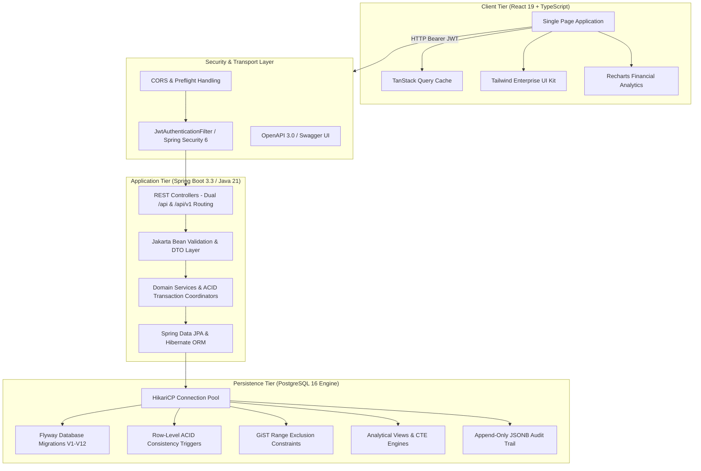

# PropLedger — Enterprise Property Management & Rental Operations Platform

[](https://openjdk.org/)
[](https://spring.io/projects/spring-boot)
[](https://www.postgresql.org/)
[](https://react.dev/)
[](https://www.typescriptlang.org/)
[](https://tailwindcss.com/)
[](https://vitejs.dev/)

> **PropLedger** is a production-grade, full-stack Property Management and Financial Operations platform engineered to mirror the operational rigor, transactional integrity, and relational complexity of Tier-1 enterprise software suites such as **Yardi Voyager**, **RealPage**, **AppFolio**, and **MRI Software**.
>
> Built specifically as a **portfolio and interview benchmark** for Senior Software Engineering, Backend Architecture, and Database Engineering roles.

---

## 📑 Strategic Enterprise Whitepaper & Yardi Modernization Proposal

> **Must Read for Enterprise Evaluators & CTOs:**  
> Read the complete architectural proposal on how PropLedger modernizes or replaces legacy ERP systems (Yardi Voyager, RealPage, MRI):  
> 🔗 [**Enterprise Solution Proposal: Modernizing Real Estate Operations with PropLedger**](docs/YARDI_ENTERPRISE_PROPOSAL.md)

---

## 🌐 Live Cloudflare Edge Deployment & Portals

| Portal | URL | Purpose |
| :--- | :--- | :--- |
| **Public Showcase & Ledger** | [**https://propledger.vishalbhutekar.me**](https://propledger.vishalbhutekar.me) | Clean modern showcase, resident statements, concierge desk |
| **Master Admin Console** | [**https://admin.vishalbhutekar.me**](https://admin.vishalbhutekar.me) | Executive operations center, credentials vault, email triggers |
| **Alternate Admin Route** | [**https://admin-propledger.vishalbhutekar.me**](https://admin-propledger.vishalbhutekar.me) | Dedicated admin gateway (SSL covered) |
| **Zensar Preparation Suite** | [**https://zensar-prep.vishalbhutekar.me**](https://zensar-prep.vishalbhutekar.me) | High-speed edge reverse proxy to Netlify preparation suite |
| **Inbound Concierge Email** | `support@propledger.vishalbhutekar.me` | Auto-forwarded via Cloudflare Workers to executive desk |

### 🛡️ Master Administrator Access
PropLedger is pre-configured with a master super-administrator account auto-provisioned on startup:
* **Email:** `vishal.bhutekar1@gmail.com`
* **Password:** `Vishal@1233`
* **Assigned Roles:** `ROLE_SUPER_ADMIN`, `ROLE_PROPERTY_MANAGER`, `ROLE_ACCOUNTANT`
* **Master Admin Console:** [**https://admin.vishalbhutekar.me**](https://admin.vishalbhutekar.me)

### 📬 Transactional Email & Invoice Pipeline (Resend + Cloudflare Workers)
The platform integrates **Resend** transactional mail routing directly into Cloudflare Workers and Spring Boot:
* **Automated Trigger:** When a lease or invoice is finalized, the worker generates a responsive HTML invoice packet with PDF attachments and delivers it to the tenant/owner.
* **Direct Edge Dispatch Command:**
  ```bash
  curl -X POST https://propledger.vishalbhutekar.me/api/send-invoice \
    -H "Content-Type: application/json" \
    -d '{
      "recipientEmail": "vishal.bhutekar1@gmail.com",
      "invoiceNumber": "INV-202609-00001",
      "amount": "$3,250.00",
      "property": "The Grand Horizon - Unit 402",
      "tenant": "Vishal Bhutekar"
    }'
  ```

---

## 🚀 How to Run PropLedger Locally

### 1. Prerequisites
* **Java:** JDK 21+ (`java -version`)
* **Node.js:** v20.0+ (`node -v`)
* **PostgreSQL:** v16+ running on port `5432` with database `propledger`
* **Maven:** v3.9+ (or use `./mvnw`)

### 2. Database Initialization
```bash
# Create database in PostgreSQL
createdb -U postgres propledger

# Run seed data manually if needed (Flyway will automatically run V1-V12 on backend launch)
psql -U postgres -d propledger -f propledger-backend/src/main/resources/db/seed/seed_data.sql
```

### 3. Start Spring Boot Backend
```bash
cd propledger-backend
# Set environment variables (or rely on application.properties defaults)
export DB_USERNAME=postgres
export DB_PASSWORD=postgres
export JWT_SECRET=5367566B59703373367639792F423F4528482B4D6251655468576D5A71347437

./mvnw spring-boot:run
# Backend will start on http://localhost:8080
# Swagger UI available at: http://localhost:8080/swagger-ui.html
```

### 4. Start React Frontend
```bash
cd propledger-frontend
npm install
npm run dev
# Frontend will start on http://localhost:5173
# Login with master credentials: vishal.bhutekar1@gmail.com / Vishal@1233
```

---

## 🏛️ System Architecture Overview



---

## ⚡ Core Technical Capabilities & Engineering Rigor

### 1. Database & Relational Design (PostgreSQL 16)
- **3NF / BCNF Normalized Architecture**: Clean functional separation across owners, properties, buildings, units, tenants, leases, and financial vouchers.
- **GiST Exclusion Constraints**: Utilizes native `btree_gist` and `daterange` to mathematically eliminate overlapping active leases on the same unit at the database engine layer.
- **Trigger-Maintained Consistency**: Recalculates invoice `balance_due` and settlement `status` atomically via row-level triggers upon `payment_allocations` mutations.
- **Targeted Partial Indexing**: Unpaid invoice balances (`WHERE balance_due > 0`) and active tickets are indexed selectively, cutting index memory footprint by over 80%.
- **Complex Analytical SQL Library**: Pre-built production queries for Rent Roll census, Aging AR delinquency buckets (30/60/90+ days), Property P&L statements, and recursive asset rollups.

### 2. Backend Engineering (Spring Boot 3.3 & Java 21)
- **Dual REST Routing**: All 13 controllers support dual endpoints (`/api/*` and `/api/v1/*`) with strict HTTP status code semantics.
- **Concurrency & Locking**: Pessimistic row locking (`SELECT FOR UPDATE`) on target invoices prevents race conditions during concurrent payment allocations; Optimistic locking (`@Version`) on work orders prevents lost updates.
- **Explicit Transaction Boundaries**: `@Transactional(rollbackFor = Exception.class)` ensures complete atomicity across multi-entity lease execution and payment allocations.
- **Zero Domain Leakage**: Complete DTO decoupling with Jakarta Bean Validation prevents mass-assignment vulnerabilities and lazy-initialization exceptions.

### 3. Frontend Architecture (React 19, TypeScript & Vite)
- **Server-State Synchronization**: TanStack React Query v5 provides stale-while-revalidate caching, automatic query deduplication, and coordinated cache invalidation across dependent resources.
- **Enterprise Design Aesthetics**: Polished dark-accented UI built with Tailwind CSS, custom KPI metric cards, interactive modals, responsive data grids, and Lucide icons.
- **Interactive Financial Visualizations**: Recharts-powered interactive SVG area charts, bar graphs, and occupancy distribution dials.

---

## 📂 Repository Structure

```text
PropLedger/
├── database/                          # Database Engineering Core
│   ├── schema/                        # Flyway baseline migrations (V1__ to V12__)
│   ├── seed/                          # Deterministic, FK-safe enterprise seed data
│   ├── indexes/                       # B-tree, Partial, GIN, and GiST indexes
│   ├── views/                         # Materialized and operational views
│   ├── functions/                     # Stored procedures & aggregation functions
│   ├── triggers/                      # Row-level consistency & audit triggers
│   ├── transactions/                  # Multi-table atomic transaction scripts
│   ├── reports/                       # Executive financial & operational SQL reports
│   └── queries/                       # 10 production SQL query modules + 15 interview queries
├── docs/                              # Comprehensive Architectural Documentation
│   ├── ER_DIAGRAM.md                  # Complete Mermaid Entity Relationship Diagram
│   ├── DATABASE_DESIGN.md             # Schema philosophy, primary keys, precision standards
│   ├── NORMALIZATION.md               # 1NF, 2NF, 3NF, BCNF proofs and denormalizations
│   ├── INDEXING_STRATEGY.md           # B-Tree, GiST, Composite, and Partial Indexing guide
│   ├── QUERY_OPTIMIZATION.md          # EXPLAIN ANALYZE tuning, scan types, join algorithms
│   ├── TRANSACTIONS.md                # ACID boundaries, isolation levels, Spring @Transactional
│   ├── CONCURRENCY.md                 # Pessimistic vs Optimistic locking, race condition mitigation
│   ├── API_DOCUMENTATION.md           # Complete REST API reference across all 13 controllers
│   ├── ARCHITECTURE.md                # Multi-tier system design, security, scalability blueprint
│   └── modules/                       # Interview-Ready Module Deep-Dives
│       ├── 01_AUTHENTICATION_AND_SECURITY.md
│       ├── 02_PROPERTY_AND_UNIT_MANAGEMENT.md
│       ├── 03_TENANT_LIFECYCLE_MANAGEMENT.md
│       ├── 04_LEASE_MANAGEMENT_AND_CONCURRENCY.md
│       ├── 05_INVOICING_BILLING_AND_PAYMENTS.md
│       ├── 06_EXPENSES_AND_VENDOR_OPERATIONS.md
│       ├── 07_MAINTENANCE_AND_WORK_ORDERS.md
│       ├── 08_ANALYTICS_REPORTS_AND_SQL_ENGINE.md
│       └── 09_AUDIT_LOGGING_AND_COMPLIANCE.md
├── propledger-backend/                # Spring Boot 3.3 / Java 21 REST API
│   ├── src/main/java/com/propledger/
│   │   ├── config/                    # Security, CORS, OpenAPI, and Cache configs
│   │   ├── controller/                # 13 REST API Controllers
│   │   ├── service/                   # Domain business logic & transaction handling
│   │   ├── repository/                # Spring Data JPA Repositories
│   │   ├── entity/                    # JPA Entities with relational mappings
│   │   ├── dto/                       # Request / Response Data Transfer Objects
│   │   ├── exception/                 # Global exception handlers (RFC 7807)
│   │   └── security/                  # JWT provider, filter, and user details
│   └── pom.xml                        # Maven configuration (Java 21 + Lombok)
└── propledger-frontend/               # React 19 + TypeScript + Vite Client
    ├── src/
    │   ├── components/                # Reusable UI kit (StatCard, Modal, StatusBadge, etc.)
    │   ├── pages/                     # 13 Complete enterprise functional pages
    │   ├── services/                  # Axios HTTP client with JWT interceptors
    │   ├── store/                     # React Context Authentication Store
    │   ├── types/                     # TypeScript domain models and API contracts
    │   └── App.tsx                    # React Router route definitions
    ├── package.json
    └── tailwind.config.js
```

---

## 🚀 Quickstart & Local Setup Guide

### Prerequisites
- **Java**: OpenJDK 21 or Microsoft Build of OpenJDK 21
- **Maven**: Apache Maven 3.9+
- **Node.js**: v18.0+ or v20.0+ with `npm`
- **PostgreSQL**: PostgreSQL 15+ (PostgreSQL 16 recommended)

---

### Step 1: Database Setup
1. Connect to your local PostgreSQL instance via `psql` or pgAdmin:
   ```sql
   CREATE DATABASE propledger;
   CREATE USER propledger_app WITH ENCRYPTED PASSWORD 'postgres';
   GRANT ALL PRIVILEGES ON DATABASE propledger TO propledger_app;
   ```
2. Enable required PostgreSQL extensions:
   ```sql
   \c propledger
   CREATE EXTENSION IF NOT EXISTS btree_gist;
   CREATE EXTENSION IF NOT EXISTS pg_trgm;
   ```
3. Run the schema migrations (`V1__` through `V12__`) or let Flyway run automatically on Spring Boot startup.
4. Load deterministic seed data:
   ```bash
   psql -U postgres -d propledger -f database/seed/seed_data.sql
   ```

---

### Step 2: Backend Configuration & Execution
1. Navigate to the backend directory:
   ```bash
   cd propledger-backend
   ```
2. Verify or update `src/main/resources/application.properties` with your PostgreSQL credentials:
   ```properties
   spring.datasource.url=jdbc:postgresql://localhost:5432/propledger
   spring.datasource.username=postgres
   spring.datasource.password=postgres
   app.jwt.secret=your_super_secret_enterprise_signing_key_that_is_at_least_256_bits_long_for_security_compliance
   ```
3. Compile and launch the Spring Boot application:
   ```bash
   mvn clean compile
   mvn spring-boot:run
   ```
   *(Or on Windows if Maven is in project folder: `& "..\apache-maven-3.9.6\bin\mvn.cmd" spring-boot:run`)*
4. Access interactive API documentation:
   - **Swagger UI**: [http://localhost:8080/swagger-ui.html](http://localhost:8080/swagger-ui.html)
   - **OpenAPI JSON**: [http://localhost:8080/v3/api-docs](http://localhost:8080/v3/api-docs)

---

### Step 3: Frontend Client Execution
1. Open a separate terminal and navigate to the frontend directory:
   ```bash
   cd propledger-frontend
   ```
2. Install dependencies:
   ```bash
   npm install
   ```
3. Launch the Vite development server:
   ```bash
   npm run dev
   ```
4. Open your browser and navigate to:
   [http://localhost:5173](http://localhost:5173)

---

## 🔑 Pre-Seeded Demonstration Accounts

| Role | Username / Email | Password | Access Capabilities |
| :--- | :--- | :--- | :--- |
| **Property Manager** | `manager@propledger.com` | `Password123!` | Complete portfolio management, tenant onboarding, leases, work orders, billing. |
| **Super Admin** | `admin@propledger.com` | `Password123!` | Full system administration, audit logs, compliance oversight, user provisioning. |
| **Accountant** | `accountant@propledger.com` | `Password123!` | Financial subledger, payments, expense vouchers, P&L statements, Aging AR. |
| **Maintenance Tech** | `tech@propledger.com` | `Password123!` | Facilities tickets, work order labor/materials logging, status dispatch. |
| **Tenant** | `tenant@propledger.com` | `Password123!` | Personal resident portal, lease view, invoice breakdown, maintenance submission. |

---

## 📚 Technical Interview & Architecture Deep-Dives

Every technical design decision made in PropLedger is thoroughly documented with architectural justifications, code snippets, and interview Q&A:

- 📊 [**Entity Relationship Diagram (Mermaid)**](docs/ER_DIAGRAM.md) — Visual data model and cardinality map.
- 📐 [**Database Design & Schema Philosophy**](docs/DATABASE_DESIGN.md) — Surrogate keys, financial precision, soft deletes, and temporal data.
- 🔢 [**Normalization Proofs (1NF to BCNF)**](docs/NORMALIZATION.md) — Theoretical proofs and trigger-maintained denormalizations.
- ⚡ [**PostgreSQL Indexing Strategy**](docs/INDEXING_STRATEGY.md) — B-Tree, GiST, Composite, and Partial Indexing.
- 🔍 [**Query Optimization & EXPLAIN ANALYZE**](docs/QUERY_OPTIMIZATION.md) — Buffer pool mechanics, scan types, join algorithms.
- 🔄 [**Transaction Management & ACID Boundaries**](docs/TRANSACTIONS.md) — Spring `@Transactional`, isolation levels, WAL logs.
- 🔒 [**Concurrency Control & Race Conditions**](docs/CONCURRENCY.md) — Pessimistic `FOR UPDATE`, Optimistic `@Version`, GiST exclusion.
- 🌐 [**Complete REST API Reference**](docs/API_DOCUMENTATION.md) — Specifications for all 13 controllers and endpoints.
- 🏗️ [**Enterprise System Architecture Blueprint**](docs/ARCHITECTURE.md) — 3-tier layering, caching, security, and scalability.
- 🏷️ [**Spring Boot & JPA Annotations Reference Guide**](docs/SPRING_ANNOTATIONS_GUIDE.md) — Under-the-hood analysis of every annotation used.
- 🔐 [**JWT Security Architecture & Lifecycle Deep-Dive**](docs/JWT_AUTHENTICATION_DEEP_DIVE.md) — Token mechanics, stateless auth, and security mitigations.
- 🔄 [**DTOs, Mappers, Spring Internals & Full-Stack Integration**](docs/DTO_MAPPER_SPRING_FRONTEND_INTEGRATION.md) — Request lifecycle, mapping, and connecting React to Spring.
- 💻 [**Frontend Engineering & Technical Interview Guide**](docs/FRONTEND_INTERVIEW_GUIDE.md) — React 19, TypeScript, TanStack Query, and 20+ interview Q&As.

### Module-Specific Interview Walkthroughs:
1. 🔐 [Module 01: Authentication, Authorization & Security](docs/modules/01_AUTHENTICATION_AND_SECURITY.md)
2. 🏢 [Module 02: Property, Building & Unit Asset Hierarchy](docs/modules/02_PROPERTY_AND_UNIT_MANAGEMENT.md)
3. 👤 [Module 03: Tenant Lifecycle & Resident Directory](docs/modules/03_TENANT_LIFECYCLE_MANAGEMENT.md)
4. 📄 [Module 04: Lease Management & Temporal Concurrency Engine](docs/modules/04_LEASE_MANAGEMENT_AND_CONCURRENCY.md)
5. 💳 [Module 05: Invoicing, Billing & Payment Settlement Subledger](docs/modules/05_INVOICING_BILLING_AND_PAYMENTS.md)
6. 🧾 [Module 06: Operating Expenses & Vendor Operations (AP)](docs/modules/06_EXPENSES_AND_VENDOR_OPERATIONS.md)
7. 🛠️ [Module 07: Facilities Maintenance & Work Order Dispatch](docs/modules/07_MAINTENANCE_AND_WORK_ORDERS.md)
8. 📈 [Module 08: Executive Analytics, Financial Reports & SQL Engine](docs/modules/08_ANALYTICS_REPORTS_AND_SQL_ENGINE.md)
9. 🛡️ [Module 09: Compliance, Audit Logging & State Reconstruction](docs/modules/09_AUDIT_LOGGING_AND_COMPLIANCE.md)

---

## 📑 Complete 10-Volume PDF Master Handbook Series (100 Pages Total)

For offline study, technical portfolio reviews, and senior staff engineer interview preparation, the platform includes **10 publication-quality PDF volumes (exactly 10 pages per document)** stored in [`docs/pdf/`](docs/pdf):

| Volume | Document File (10 Pages Each) | Core Technical Focus & Functionality |
| :---: | :--- | :--- |
| **Vol 01** | [**01_Enterprise_System_Architecture.pdf**](docs/pdf/01_Enterprise_System_Architecture.pdf) | Multi-tier topology, Tomcat internals, HikariCP sizing, CQRS-Lite routing, and G1/ZGC memory tuning. |
| **Vol 02** | [**02_Database_Schema_And_Data_Modeling.pdf**](docs/pdf/02_Database_Schema_And_Data_Modeling.pdf) | PostgreSQL 16 DDL, asset hierarchy, tenant relationships, AR ledger invariants, and JSONB audit trails. |
| **Vol 03** | [**03_Advanced_SQL_And_Analytics_Engine.pdf**](docs/pdf/03_Advanced_SQL_And_Analytics_Engine.pdf) | 5-table joins, CTE materialization, Window Functions, DENSE_RANK(), aging AR, and recursive queries. |
| **Vol 04** | [**04_Normalization_Indexing_And_Performance.pdf**](docs/pdf/04_Normalization_Indexing_And_Performance.pdf) | 1NF-BCNF proofs, ESR composite rule, partial indexes, NVMe cost tuning, and EXPLAIN ANALYZE. |
| **Vol 05** | [**05_Transactions_Concurrency_And_ACID.pdf**](docs/pdf/05_Transactions_Concurrency_And_ACID.pdf) | Multi-table ACID workflows, MVCC isolation levels, Spring AOP proxy gotchas, and deadlock prevention. |
| **Vol 06** | [**06_Identity_JWT_And_Spring_Security.pdf**](docs/pdf/06_Identity_JWT_And_Spring_Security.pdf) | Stateless JWT (RFC 7519), BCrypt-12, OncePerRequestFilter, SecurityConfig, and attack mitigations. |
| **Vol 07** | [**07_Spring_Boot_API_And_Domain_Services.pdf**](docs/pdf/07_Spring_Boot_API_And_Domain_Services.pdf) | Dual-routing controllers, DTO patterns, builder mappers, Jakarta validation, and RFC 7807 exceptions. |
| **Vol 08** | [**08_Financial_Subledger_And_Billing_Engine.pdf**](docs/pdf/08_Financial_Subledger_And_Billing_Engine.pdf) | Stored procedure batch billing, split payment allocations, row triggers, OpEx vs CapEx, and NOI. |
| **Vol 09** | [**09_Frontend_Architecture_And_React19.pdf**](docs/pdf/09_Frontend_Architecture_And_React19.pdf) | React 19 Actions, TypeScript discriminated unions, TanStack Query invalidation, and Recharts curves. |
| **Vol 10** | [**10_FullStack_Integration_And_Interview_Handbook.pdf**](docs/pdf/10_FullStack_Integration_And_Interview_Handbook.pdf) | End-to-end Axios interceptors, CORS preflight, automated testing pyramids, and 360° interview pitch. |

*Note: All 10 PDFs can be re-generated at any time using: `python scripts/pdf_generator/build_all.py`*

---

## 🎯 Top Interview Questions PropLedger Answers

<details>
<summary><b>1. How do you prevent two leasing agents from booking the same apartment at the same second?</b></summary>
<br>
Application-level checks are vulnerable to race conditions under concurrent requests. PropLedger implements a multi-layer defense:
1. <b>Application Layer</b>: Acquires a pessimistic write lock (<code>SELECT ... FOR UPDATE</code>) on the unit record before creating the lease.
2. <b>Database Engine Layer</b>: Enforces a PostgreSQL <code>EXCLUDE USING gist</code> constraint on <code>(unit_id WITH =, daterange(start_date, end_date, '[]') WITH &&) WHERE (status IN ('ACTIVE', 'DRAFT'))</code>. If two transactions attempt to insert overlapping date intervals, PostgreSQL atomically raises an exclusion constraint violation (<code>23P01</code>), guaranteeing zero double-booking regardless of application concurrency.
</details>

<details>
<summary><b>2. How do you handle partial payments and multi-invoice settlement in a double-entry style ledger?</b></summary>
<br>
We separate payments from invoices via a junction settlement entity called <code>payment_allocations</code>. When a tenant pays $2,500, a single payment voucher is recorded, and allocations are distributed across multiple overdue invoices in ascending ID order under a single ACID transaction. A PostgreSQL row-level trigger (<code>trg_update_invoice_balance</code>) automatically recalculates each invoice's <code>balance_due</code> and transitions its status between <code>PENDING</code>, <code>PARTIALLY_PAID</code>, and <code>PAID</code> atomically, protected by <code>CHECK (balance_due >= 0)</code>.
</details>

<details>
<summary><b>3. Why choose 3NF with trigger-maintained denormalization over pure normalization?</b></summary>
<br>
Pure 3NF normalization would require calculating an invoice's remaining balance on every read by summing all historical <code>payment_allocations</code>, and calculating unit availability by evaluating all historical lease date ranges. On high-volume dashboards and checkout screens, these subqueries create severe I/O bottlenecks. PropLedger caches derived aggregates (<code>invoices.balance_due</code>, <code>units.status</code>) directly on parent tables, but <b>never</b> allows application code to manipulate that state manually. Instead, ACID-compliant database triggers synchronize those fields in lockstep on every insert/update/delete, providing $O(1)$ read performance with guaranteed transactional consistency.
</details>

---

## 📄 License
This project is open source and available under the [MIT License](LICENSE).
