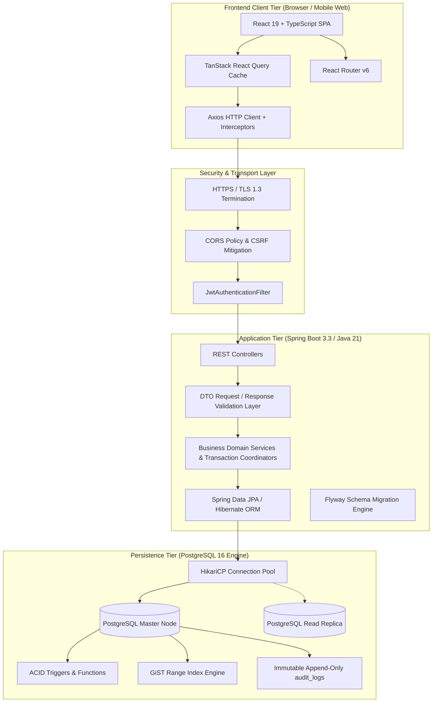
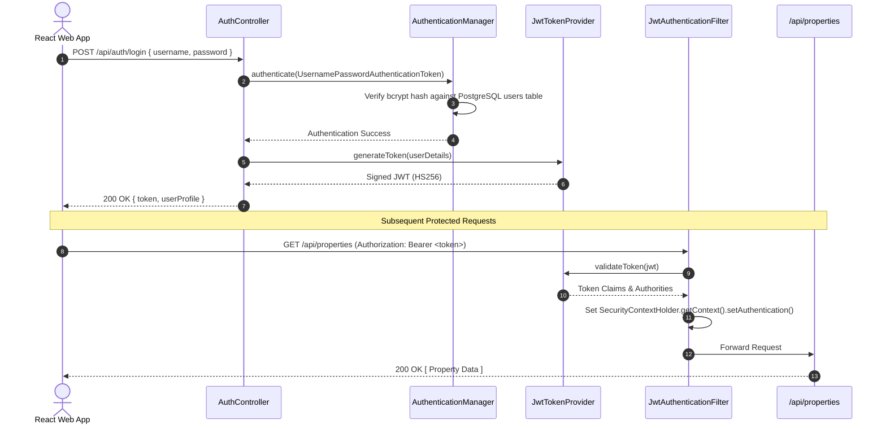

# PropLedger — Enterprise System Architecture & Engineering Blueprint

## 1. High-Level System Architecture

PropLedger is architected as an enterprise multi-tier web application designed for high availability, zero-data-loss financial integrity, and sub-second analytical reporting:



---

## 2. Multi-Tier Layering & Separation of Concerns

PropLedger strictly separates responsibilities across four distinct layers:

### 2.1. Web & Controller Layer (`com.propledger.controller`)
- **Responsibilities**:
  - Exposes REST endpoints conforming to OpenAPI 3.0 standards.
  - Enforces HTTP method semantics (`GET`, `POST`, `PUT`, `DELETE`).
  - Triggers bean validation on incoming payloads (`@Valid`).
  - Maps domain responses into standardized `ApiResponse<T>` or `PagedResponse<T>` envelopes.
- **Rules**: Zero business logic or database queries inside controllers.

### 2.2. Service & Transaction Layer (`com.propledger.service`)
- **Responsibilities**:
  - Implements complex real estate domain workflows (e.g. lease execution, payment allocation, aging AR computation).
  - Orchestrates multi-entity operations under `@Transactional` boundaries.
  - Handles concurrency locks (Pessimistic `FOR UPDATE` or Optimistic `@Version`).
  - Dispatches audit trail records upon entity modification.
- **Rules**: Services are transaction boundaries; rollback policies are explicitly configured (`rollbackFor = Exception.class`).

### 2.3. Data Access & Repository Layer (`com.propledger.repository`)
- **Responsibilities**:
  - Extends `JpaRepository<T, ID>` for standard CRUD operations.
  - Encapsulates type-safe JPQL queries and native SQL queries for analytical views.
  - Implements pagination (`Pageable`) and sorting (`Sort`).
  - Defines concurrency locking hints (`@Lock(LockModeType.PESSIMISTIC_WRITE)`).
- **Rules**: Queries are optimized to prevent $N+1$ query cascades via `JOIN FETCH`.

### 2.4. Database Engine Layer (`PostgreSQL`)
- **Responsibilities**:
  - Enforces relational invariants via Foreign Keys, Check Constraints, and Unique Constraints.
  - Eliminates lease scheduling collisions via `btree_gist` Exclusion Constraints.
  - Synchronizes derived denormalizations (`invoices.balance_due`, `units.status`) via triggers.
  - Evaluates complex analytical queries (rent rolls, aging buckets) using CTEs and Window Functions.

---

## 3. DTO vs. Domain Entity Mapping Strategy

In enterprise software, exposing JPA entities directly through REST controllers is a dangerous anti-pattern:
1. **Security / Mass-Assignment Vulnerability**: A malicious user could submit `{ "id": 1, "status": "PAID" }` in a request body, bypassing business rules.
2. **Infinite Recursion / Circular References**: Jackson serialization fails with `StackOverflowError` when serializing bidirectional relationships (`Property -> Units -> Property`).
3. **LazyInitializationException**: Accessing uninitialized lazy associations outside transaction boundaries crashes the serializer.

### PropLedger DTO Architecture:
- Every entity has dedicated **Request** and **Response** DTOs (e.g. `PropertyCreateDto`, `PropertyResponseDto`, `LeaseDto`).
- DTOs contain Jakarta Bean Validation annotations:
  ```java
  @NotBlank(message = "Property code is mandatory")
  @Pattern(regexp = "^[A-Z0-9-]+$", message = "Property code must be alphanumeric")
  private String propertyCode;

  @NotNull(message = "Market rent cannot be null")
  @DecimalMin(value = "0.01", message = "Rent must be positive")
  private BigDecimal marketRent;
  ```
- Mappings are decoupled, preventing internal schema changes from breaking client API contracts.

---

## 4. Security Architecture & Stateless Authentication

PropLedger implements a zero-trust, stateless security architecture:



### Security Highlights:
- **BCrypt Password Hashing**: Passwords are salted and hashed with work factor 12. Plaintext passwords never enter memory beyond the authentication handshake.
- **Fine-Grained Role-Based Access Control (RBAC)**:
  - `SUPER_ADMIN`: Unrestricted administrative and database compliance access.
  - `PROPERTY_MANAGER`: Full asset, tenant, lease, maintenance, and invoicing lifecycle.
  - `ACCOUNTANT`: Read-only access to properties/leases; full access to ledger, payments, expenses, and financial P&L reports.
  - `MAINTENANCE_TECH`: Read units; update work orders and maintenance statuses.
  - `TENANT`: Restricted strictly to their own lease, balance, invoices, and maintenance submissions.

---

## 5. Frontend Architecture & State Management

Built with **React 19**, **TypeScript**, and **Vite**, the client leverages **TanStack React Query** for server-state management.

### 5.1. Why TanStack Query over Redux for PropLedger?
- **Server State vs. Client State**: Real estate data is owned by the server. Redux requires hundreds of lines of boilerplate (actions, reducers, thunks) to mirror server data.
- **Stale-While-Revalidate**: React Query serves cached data instantly while refreshing in the background.
- **Automatic Cache Invalidation**: When a user records a payment, React Query automatically invalidates and refetches `['invoices']`, `['dashboard-stats']`, and `['aging-ar']`, ensuring immediate UI consistency.

```typescript
// Example Cache Invalidation on Payment Mutation
const queryClient = useQueryClient();

const createPaymentMutation = useMutation({
  mutationFn: (newPayment: PaymentRequest) => api.post('/api/payments', newPayment),
  onSuccess: () => {
    // Invalidate dependent query caches simultaneously
    queryClient.invalidateQueries({ queryKey: ['payments'] });
    queryClient.invalidateQueries({ queryKey: ['invoices'] });
    queryClient.invalidateQueries({ queryKey: ['dashboard-stats'] });
  }
});
```

---

## 6. High Availability, Scalability & Production Readiness

### 6.1. Connection Pooling with HikariCP
PostgreSQL processes each incoming connection with an OS-level process (~10MB RAM per connection). Unbounded connections crash the database:
- PropLedger configures **HikariCP**:
  - `maximumPoolSize = 20` (Optimized for $2 \times \text{CPU cores} + \text{spindle count}$).
  - `minimumIdle = 10`
  - `connectionTimeout = 30000ms`
  - `idleTimeout = 600000ms`
  - `maxLifetime = 1800000ms`

### 6.2. CQRS-Style Read/Write Connection Routing
For high-traffic enterprise deployments:
- **Write Operations** (`POST`, `PUT`, `DELETE`): Routed to the primary PostgreSQL writer node.
- **Analytical & Reporting Queries** (`GET /api/reports/*`, `GET /api/dashboard/*`): Routed via Spring's `AbstractRoutingDataSource` to asynchronous read replicas, isolating heavy reporting workloads from critical tenant checkouts.
