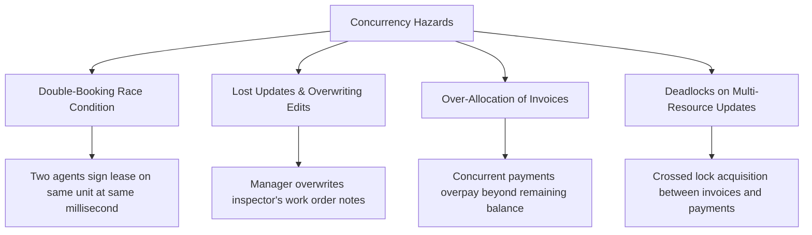
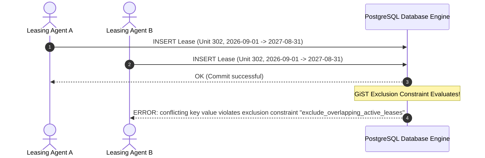

# PropLedger — Concurrency Control & Race Condition Mitigation

## 1. Concurrency Threats in Real Estate Operations

In enterprise property management, high concurrent traffic from leasing agents, tenants, accounting systems, and external payment webhooks creates severe concurrency hazards:



---

## 2. Concurrency Mechanisms: Optimistic vs. Pessimistic Locking

| Metric | Optimistic Locking (`@Version`) | Pessimistic Locking (`SELECT ... FOR UPDATE`) |
| :--- | :--- | :--- |
| **Philosophy** | "Conflicts are rare; detect on commit and abort/retry." | "Conflicts are likely or unacceptable; hold locks to serialize access." |
| **Mechanism** | An integer `version` column is incremented on every update (`UPDATE table SET col = val, version = version + 1 WHERE id = 1 AND version = 2`). If rows affected is 0, throws `OptimisticLockException`. | PostgreSQL acquires an exclusive row lock (`RowExclusiveLock`) in memory, blocking other transactions until commit or rollback. |
| **Best Used For** | UI edits on entities with human latency (e.g. Property info, Tenant profile, Work Order descriptions). | High-stakes financial ledger mutations (e.g. Invoice payment allocation, Bank settlement). |
| **Lock Overhead** | Zero database locks held. | Holds row locks for the duration of the transaction. |

---

## 3. Deep-Dive Scenarios & Code Implementations

### 3.1. Scenario 1: Preventing Concurrent Invoice Over-Allocation
**Problem**: An invoice has a `balance_due` of \$1,000. 
- At $t=0$, Tenant's automated auto-pay posts \$1,000.
- At $t=1$, Tenant manually clicks "Pay Now" on the web portal for \$1,000.
- If both threads read `balance_due = 1000` simultaneously, both insert \$1,000 allocations, resulting in a \$1,000 negative balance (accounting error).

#### Solution: Pessimistic Row Locking (`PESSIMISTIC_WRITE`)
In Spring Data JPA Repository:
```java
public interface InvoiceRepository extends JpaRepository<Invoice, Long> {

    @Lock(LockModeType.PESSIMISTIC_WRITE)
    @QueryHints({@QueryHint(name = "jakarta.persistence.lock.timeout", value = "3000")})
    @Query("SELECT i FROM Invoice i WHERE i.id = :id")
    Optional<Invoice> findByIdForUpdate(@Param("id") Long id);
}
```

Generated SQL executed in PostgreSQL:
```sql
SELECT * FROM invoices 
WHERE id = 104 
FOR UPDATE;
```

Execution Behavior:
- **Thread 1** executes `SELECT ... FOR UPDATE` and acquires the exclusive row lock on Invoice #104.
- **Thread 2** arrives and attempts `SELECT ... FOR UPDATE`. Thread 2 is **blocked** by PostgreSQL until Thread 1 commits.
- Thread 1 reduces `balance_due` from \$1,000 to \$0 and commits.
- Thread 2 wakes up, reads the freshly committed `balance_due = $0`, realizes the invoice is already settled, and rejects the duplicate payment.

---

### 3.2. Scenario 2: Preventing Double-Booking of Units
**Problem**: Agent A and Agent B are showing Unit 302 to different clients. Both clients agree to sign a lease starting September 1st, 2026. Both agents click "Create Lease" at 10:00:00 AM.

PropLedger implements **three defensive layers**:



1. **Layer 1: Pessimistic Lock on Unit**:
   Before creating the lease, the backend executes `SELECT * FROM units WHERE id = :unitId FOR UPDATE`.
2. **Layer 2: Unit Status Verification**:
   The code verifies `unit.getStatus() == UnitStatus.AVAILABLE`.
3. **Layer 3: Engine-Enforced Exclusion Constraint**:
   If application logic fails or is bypassed via a raw SQL script, PostgreSQL's `btree_gist` constraint triggers:
   ```sql
   CONSTRAINT exclude_overlapping_active_leases 
   EXCLUDE USING gist (
       unit_id WITH =,
       daterange(start_date, end_date, '[]') WITH &&
   ) WHERE (status IN ('ACTIVE', 'DRAFT'));
   ```
   The engine rejects the transaction with state `23P01`.

---

### 3.3. Scenario 3: Lost Updates on Work Orders (Optimistic Locking)
**Problem**: 
- Property Manager opens Work Order #42 in their browser to update vendor instructions.
- Maintenance Technician opens Work Order #42 on their mobile tablet to mark parts installed.
- The manager saves. Ten seconds later, the technician saves. 
- *Result*: The manager's vendor instructions are silently overwritten.

#### Solution: JPA `@Version` Field
In `WorkOrder.java`:
```java
@Entity
@Table(name = "work_orders")
public class WorkOrder {

    @Id
    @GeneratedValue(strategy = GenerationType.IDENTITY)
    private Long id;

    private String description;

    @Version
    @Column(name = "version")
    private Long version;
    
    // Getters and Setters
}
```

#### Under the Hood:
When the manager saves:
```sql
UPDATE work_orders 
SET description = 'Updated notes', version = 2 
WHERE id = 42 AND version = 1;
-- 1 row affected. Succeeded.
```
When the technician tries to save with stale version 1:
```sql
UPDATE work_orders 
SET status = 'IN_PROGRESS', version = 2 
WHERE id = 42 AND version = 1;
-- 0 rows affected!
```
Hibernate detects `0 rows affected` and throws `OptimisticLockException`. The frontend receives HTTP 409 Conflict: *"This work order was modified by another user. Please refresh and review latest updates."*

---

## 4. Deadlock Detection & Prevention

### 4.1. What Causes a Deadlock?
A deadlock occurs when two transactions hold locks that the other needs in a circular dependency:
- **Transaction 1** locks Invoice A, wants Invoice B.
- **Transaction 2** locks Invoice B, wants Invoice A.
- Neither transaction can proceed.

### 4.2. Deadlock Resolution in PostgreSQL
PostgreSQL runs a background deadlock detector. When a transaction waits longer than `deadlock_timeout` (default: 1 second):
1. PostgreSQL builds the wait-for graph.
2. If a cycle exists, it picks one transaction as the **victim** and terminates it:
   `ERROR: deadlock detected (SQLState: 40P01)`.
3. The remaining transaction finishes.

### 4.3. PropLedger Prevention Rule: Ordered Resource Acquisition
To guarantee deadlocks are mathematically impossible, PropLedger enforces **Resource Ordering**:
*When locking multiple entities (e.g. paying multiple invoices in a batch), resources must ALWAYS be locked in ascending primary key order!*

```java
// SORT IDs ASCENDING BEFORE ACQUIRING PESSIMISTIC LOCKS
List<Long> sortedInvoiceIds = invoiceIds.stream()
    .sorted()
    .collect(Collectors.toList());

for (Long invId : sortedInvoiceIds) {
    Invoice invoice = invoiceRepository.findByIdForUpdate(invId)
        .orElseThrow();
    // Process allocation
}
```
Because all threads request locks in the same order (`101 -> 102 -> 103`), a circular wait cycle ($A \to B$ and $B \to A$) can **never** form.

---

## 5. Interview Q&A on Concurrency

| Question | Strong Candidate Answer |
| :--- | :--- |
| **"What is the difference between `FOR UPDATE`, `FOR UPDATE NOWAIT`, and `FOR UPDATE SKIP LOCKED`?"** | `FOR UPDATE` blocks until the holding transaction releases the lock. `FOR UPDATE NOWAIT` immediately errors out if the row is locked, preventing thread starvation. `FOR UPDATE SKIP LOCKED` skips locked rows entirely; it is ideal for high-throughput job queues where multiple worker threads pick up pending maintenance tickets or batch email alerts without contending on the same rows. |
| **"How do you handle high-concurrency payment retries from Stripe/Plaid webhooks?"** | We combine database-level pessimistic row locking on the target invoice with an **idempotency token** unique constraint on the payment transaction table (`UNIQUE (idempotency_key)`). If the gateway sends duplicate webhooks simultaneously, the first thread locks the invoice and processes the payment, while the second thread either blocks on the row lock or immediately fails with a unique constraint violation on the idempotency key. |
