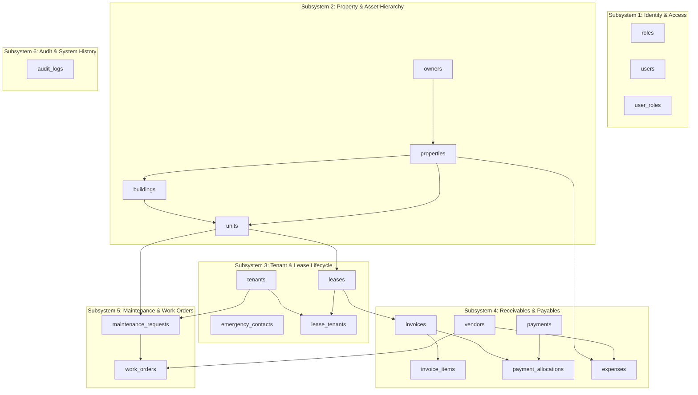

# PropLedger — Relational Database Design & Data Architecture

## 1. Executive Summary & Design Philosophy

**PropLedger** is an enterprise-grade Property Management and Rental Operations Platform engineered to support institutional real estate portfolios (similar in scope and rigor to **Yardi Voyager**, **RealPage**, and **AppFolio**). 

The database architecture is designed with the following foundational principles:
1. **Financial Immutability & Double-Entry Awareness**: Ledger transactions (invoices, payments, allocations, expenses) maintain absolute referential integrity. Invoices cannot be silently modified once paid; payments cannot exceed unpaid balances; and every financial mutation is permanently captured in an audit trail.
2. **Temporal Integrity & Overlap Prevention**: Leases and occupancy represent time-bound spans. The database enforces zero overlapping active leases on the same unit using PostgreSQL `btree_gist` exclusion constraints with native `daterange` types.
3. **Data Integrity over Application Logic**: While Spring Boot validates inputs, the PostgreSQL schema strictly enforces domain rules via foreign keys, check constraints, unique constraints, and ACID-compliant triggers. If application code has a bug or concurrent race condition, the database engine guarantees zero data corruption.
4. **Third Normal Form (3NF) with Controlled Materialization**: Core OLTP tables are normalized to 3NF/BCNF. Heavy analytical reads (e.g., occupancy rates, aged receivables, rent roll summaries) are served via database views, common table expressions (CTEs), and selective denormalized cached counters (such as `invoices.balance_due` kept in lockstep via row-level triggers).

---

## 2. Global Schema Architecture & Domain Subsystems

The database is divided into six core operational subsystems across 12 migration scripts (`V1__` through `V12__`):

---

## 3. Detailed Entity Breakdown & Attribute Specifications

### 3.1. Identity & Access Management (IAM)
- **`roles`**: Defines enterprise RBAC tiers: `SUPER_ADMIN`, `PROPERTY_MANAGER`, `LEASING_AGENT`, `ACCOUNTANT`, `MAINTENANCE_TECH`, `TENANT`.
- **`users`**: Contains credential hashes (bcrypt 12 rounds), status (`ACTIVE`, `SUSPENDED`, `INACTIVE`), and security timestamps (`last_login_at`, `password_changed_at`).
- **`user_roles`**: Many-to-many junction table binding users to roles with `assigned_at` tracking.

### 3.2. Property & Asset Hierarchy
Real estate portfolio assets follow a strict 3-tier hierarchy:
1. **Property (Asset Level)**: `properties` table.
   - Represents a legal real estate asset or master development (e.g., "Grandview Heights").
   - Attributes: `property_code` (Indexed, Unique), `owner_id` (FK to `owners`), `property_type` (`RESIDENTIAL_MULTIFAMILY`, `COMMERCIAL_OFFICE`, `MIXED_USE`, `INDUSTRIAL`), `address_line1`, `city`, `state`, `postal_code`, `year_built`, `total_area_sqft`.
2. **Building (Structure Level)**: `buildings` table (Optional for single-structure properties).
   - Represents physical towers or blocks (e.g., "Tower A", "North Wing").
   - Attributes: `property_id` (FK), `building_name`, `building_code`, `total_floors`.
3. **Unit (Rentable Space Level)**: `units` table.
   - Represents individual rentable spaces (e.g., "Unit 402", "Suite 100").
   - Attributes: `unit_number`, `property_id` (FK), `building_id` (FK, nullable), `unit_type` (`STUDIO`, `ONE_BEDROOM`, `TWO_BEDROOM`, `PENTHOUSE`, `COMMERCIAL`), `bedrooms`, `bathrooms`, `area_sqft`, `market_rent` (`NUMERIC(12,2)`), `status` (`AVAILABLE`, `OCCUPIED`, `MAINTENANCE`, `RESERVED`).
   - Unique Constraint: `UNIQUE (property_id, building_id, unit_number)` ensures unique numbering within structures.

### 3.3. Tenant & Lease Lifecycle
- **`tenants`**: Individual or commercial entity leasing space.
   - PII fields (`first_name`, `last_name`, `email`, `phone`, `date_of_birth`, `tax_id_or_ssn_encrypted`).
   - Verification metadata: `employment_status`, `annual_income`, `credit_score`, `emergency_contact`.
- **`leases`**: Legal contracts governing unit occupancy.
   - Attributes: `lease_number` (Unique formatted identifier e.g., `LSE-2026-0001`), `unit_id` (FK), `start_date`, `end_date`, `rent_amount` (`NUMERIC(12,2)`), `deposit_amount` (`NUMERIC(12,2)`), `payment_due_day` (1–28), `status` (`DRAFT`, `ACTIVE`, `TERMINATED`, `EXPIRED`, `RENEWED`).
   - GiST Exclusion Constraint: Enforces that no two `ACTIVE` leases can overlap in date range on the same `unit_id`.
- **`lease_tenants`**: Junction table supporting co-signers and roommates.
   - Attributes: `lease_id` (FK), `tenant_id` (FK), `is_primary_tenant` (BOOLEAN), `guarantor` (BOOLEAN).

### 3.4. Accounts Receivable (AR) & Accounts Payable (AP)
- **`invoices`**: Accounts receivable billings issued against a lease.
   - Attributes: `invoice_number` (Unique, e.g. `INV-2026-00101`), `lease_id` (FK), `invoice_date`, `due_date`, `total_amount` (`NUMERIC(14,2)`), `balance_due` (`NUMERIC(14,2)`), `status` (`PENDING`, `PARTIALLY_PAID`, `PAID`, `OVERDUE`, `VOID`).
   - Check Constraint: `CHECK (balance_due >= 0 AND balance_due <= total_amount)`.
- **`invoice_items`**: Granular breakdown of charges.
   - Categories: `BASE_RENT`, `PARKING_FEE`, `UTILITY_WATER`, `UTILITY_ELECTRIC`, `LATE_FEE`, `SECURITY_DEPOSIT`, `PET_FEE`.
- **`payments`**: Monies received from tenants.
   - Attributes: `payment_reference`, `tenant_id` (FK), `payment_method` (`ACH`, `CREDIT_CARD`, `CHECK`, `WIRE_TRANSFER`), `amount` (`NUMERIC(14,2)`), `payment_date`, `status` (`PENDING`, `SETTLED`, `FAILED`, `REFUNDED`).
- **`payment_allocations`**: Double-entry settlement link between `payments` and `invoices`.
   - Attributes: `payment_id` (FK), `invoice_id` (FK), `allocated_amount` (`NUMERIC(14,2)`), `allocated_at`.
   - Business Rule: A single payment of $2,500 can be split: $2,000 to past overdue invoice, $500 to current rent invoice.
- **`vendors`**: External contractors and utility providers.
- **`expenses`**: Operating expenses (OpEx) and Capital expenditures (CapEx) against properties.
   - Attributes: `property_id` (FK), `vendor_id` (FK), `category` (`REPAIRS`, `UTILITIES`, `LANDSCAPING`, `INSURANCE`, `PROPERTY_TAX`, `LEGAL`, `CAPITAL_IMPROVEMENT`), `amount` (`NUMERIC(14,2)`), `expense_date`.

### 3.5. Maintenance & Facility Operations
- **`maintenance_requests`**: Resident-submitted or staff-created issue tickets.
   - Attributes: `ticket_number`, `unit_id` (FK), `tenant_id` (FK), `priority` (`LOW`, `MEDIUM`, `HIGH`, `EMERGENCY`), `category` (`PLUMBING`, `HVAC`, `ELECTRICAL`, `APPLIANCE`, `STRUCTURAL`), `status` (`SUBMITTED`, `ASSIGNED`, `IN_PROGRESS`, `COMPLETED`, `CANCELLED`).
- **`work_orders`**: Formal internal/external dispatch to resolve maintenance tickets.
   - Attributes: `work_order_number`, `request_id` (FK), `vendor_id` (FK, nullable), `assigned_user_id` (FK, nullable), `labor_cost`, `material_cost`, `total_cost`.

### 3.6. Audit Logging & Compliance
- **`audit_logs`**: Append-only log recording every modification to sensitive tables (`leases`, `invoices`, `payments`, `units`).
   - Attributes: `id` (BIGSERIAL), `table_name`, `record_id`, `action` (`INSERT`, `UPDATE`, `DELETE`), `changed_by_user_id`, `old_values` (JSONB), `new_values` (JSONB), `client_ip`, `created_at`.

---

## 4. Primary Key & Identifier Strategy

| Strategy | Usage in PropLedger | Technical Rationale |
| :--- | :--- | :--- |
| **BIGSERIAL / BIGINT** | Internal surrogate primary keys across all operational tables (`id`) | 8-byte sequential integers minimize B-tree index depth, prevent page fragmentation during high-volume inserts, and maintain cache locality in PostgreSQL Buffer Pool. |
| **UUID (v4)** | External Public Identifiers (`public_id` or reference codes) | Prevents enumeration attacks across REST endpoints (e.g., prevents competitors guessing invoice IDs by scraping `/api/invoices/1`, `/api/invoices/2`). |
| **Formatted Business Codes** | User-facing references (`property_code`, `lease_number`, `invoice_number`) | Enterprise users demand human-readable codes (e.g. `PROP-GRV-01`, `INV-2026-00452`) with strict uniqueness constraints and search indexing. |

---

## 5. Financial Precision & Data Type Standards

- **Money / Currencies**: `NUMERIC(14, 2)` is enforced on all financial columns (`rent_amount`, `total_amount`, `balance_due`, `allocated_amount`, `amount`).
  - *Anti-Pattern Avoided*: Never use `FLOAT` or `DOUBLE PRECISION` for currency due to binary floating-point rounding errors (e.g., `0.1 + 0.2 = 0.30000000000000004`).
  - *PostgreSQL `MONEY` Type Avoided*: The built-in `money` type is locale-dependent and problematic for serialization across JDBC drivers. `NUMERIC(14,2)` allows amounts up to \$999,999,999,999.99 with fixed precision.
- **Timestamps**: `TIMESTAMPTZ` (`TIMESTAMP WITH TIME ZONE`) is mandatory for all temporal audit and event tracking (`created_at`, `updated_at`, `payment_date`, `allocated_at`). All timestamps are stored in UTC.
- **Calendar Dates**: `DATE` is used for business calendar boundaries where time of day is irrelevant (`start_date`, `end_date`, `due_date`, `expense_date`).
- **Enums vs Check Constraints**: Text columns with check constraints (`VARCHAR(30) CHECK (status IN ('ACTIVE', 'TERMINATED', ...))`) are chosen over PostgreSQL `CREATE TYPE ... AS ENUM`.
  - *Enterprise Rationale*: Altering native PostgreSQL enums in older versions or migrations with active connections locks tables or requires complex migrations. Check constraints are easily validated, indexed, and altered with zero downtime.

---

## 6. Referential Integrity & Deletion Mechanics

| Relationship | On Delete Action | Justification |
| :--- | :--- | :--- |
| `properties -> units` | `ON DELETE RESTRICT` | A property with registered units cannot be dropped accidentally. |
| `units -> leases` | `ON DELETE RESTRICT` | Legal lease history cannot be orphaned. |
| `leases -> invoices` | `ON DELETE RESTRICT` | Financial ledger records must remain intact for tax and legal compliance. |
| `invoices -> invoice_items` | `ON DELETE CASCADE` | Line items are owned strictly by the parent invoice lifecycle. |
| `payments -> payment_allocations` | `ON DELETE RESTRICT` | Settled financial transactions are immutable; voids are handled via offsetting credits. |
| `maintenance_requests -> work_orders` | `ON DELETE RESTRICT` | Operations work history cannot be deleted once created. |

### Soft Deletion vs. Temporal Archiving
Operational entities (`properties`, `units`, `tenants`, `users`) contain an `is_active BOOLEAN DEFAULT true` flag. Physical `DELETE` statements are barred on core ledger entities. When a tenant moves out or a property is decommissioned, `is_active` is toggled to `false`, preserving all historical reporting, tax schedules, and rent rolls.
