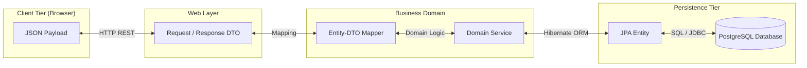
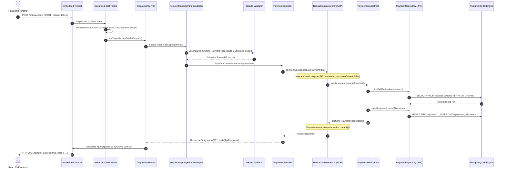
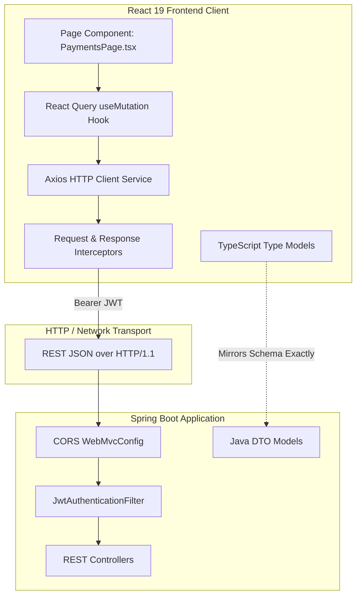

# PropLedger — DTOs, Mappers, Spring Internals & Full-Stack Integration Architecture

## 1. Part 1: What is a DTO (Data Transfer Object) and Why is it Mandatory?

### 1.1. Definition
A **Data Transfer Object (DTO)** is a plain Java object (POJO) designed solely to carry data across architectural layers—specifically between the client (HTTP / REST API) and the server's service layer. Unlike JPA Entities, a DTO contains **no business logic, no database annotations, and no persistence state**.



---

### 1.2. Why Exposing JPA Entities Directly is an Enterprise Anti-Pattern

In novice projects, developers often return JPA Entities directly from `@RestController` methods:
```java
// ❌ CATASTROPHIC ANTI-PATTERN: Exposing JPA Entity directly!
@GetMapping("/properties/{id}")
public Property getProperty(@PathVariable Long id) {
    return propertyRepository.findById(id).orElseThrow();
}
```

This causes four severe architectural and security breakdowns:

#### Hazard 1: Mass-Assignment / Over-Posting Security Vulnerability
If an API accepts a JPA Entity directly in `@RequestBody`, an attacker can modify sensitive fields that the client should never touch:
```json
// Attacker sends:
{
  "id": 104,
  "balanceDue": 0.00,
  "status": "PAID"
}
```
If the entity is saved directly, the attacker resets their invoice debt to zero!
*PropLedger Solution*: Request DTOs (`PropertyCreateDto`, `PaymentRequestDto`) strictly expose only the fields a user is permitted to supply. Uneditable fields (`balanceDue`, `createdAt`, `version`) do not exist in the Request DTO.

#### Hazard 2: Infinite Recursion & `StackOverflowError`
Real estate entities have bidirectional associations (`Property` has many `Unit`s; each `Unit` references its parent `Property`). When Jackson attempts to serialize `Property`, it serializes `units`, which serializes `property`, which serializes `units`... until the JVM crashes with:
```text
java.lang.StackOverflowError: Infinite recursion (StackOverflowError) through reference chain
```
*PropLedger Solution*: Response DTOs flatten or selectively nest representations, breaking the circular graph completely.

#### Hazard 3: `LazyInitializationException`
To prevent massive performance degradation, associations like `@OneToMany List<Unit> units` are marked with `fetch = FetchType.LAZY`. If an entity is returned from a controller, the transaction has already closed. When Jackson serializes the uninitialized proxy outside the transaction, Hibernate throws:
```text
org.hibernate.LazyInitializationException: could not initialize proxy - no Session
```
*PropLedger Solution*: Mappers copy required fields inside the service layer while the transaction is active, shielding the presentation layer from lazy-loading issues.

#### Hazard 4: API Contract Fragility
If you rename a database column (e.g. `rent_amount` to `base_contract_rent`), your REST API contract immediately breaks for all mobile, frontend, and third-party consumers.
*PropLedger Solution*: The DTO contract remains immutable even when the internal database schema is refactored.

---

## 2. Part 2: What is a Mapper and How Does it Transform Data?

### 2.1. Definition & Role
A **Mapper** is a specialized translation component responsible for converting:
1. **Request DTO $\to$ JPA Entity**: Unpacks user inputs into domain models ready for persistence.
2. **JPA Entity $\to$ Response DTO**: Extracts entity attributes into clean, formatted, client-ready responses.

### 2.2. Mapping Approaches Compared

| Approach | How it Works | Pros | Cons | Usage in PropLedger |
| :--- | :--- | :--- | :--- | :--- |
| **Manual Builder / Static Methods** | Explicit Java code using Lombok `@Builder` | **Fastest execution (0 reflection)**, complete compile-time type safety, easy debugging with breakpoints. | Requires writing conversion code. | **Selected Standard for PropLedger** |
| **MapStruct** | Annotation processor generates mapper `.class` code during compile. | High performance, zero runtime overhead. | Requires extra plugin configuration in `pom.xml`. | Excellent enterprise alternative. |
| **ModelMapper / Dozer** | Uses runtime Java reflection to match field names. | Less boilerplate code. | **Slow (10x-50x runtime overhead)**, runtime errors, hard to debug when fields mismatch. | **Barred in high-throughput systems**. |

### 2.3. PropLedger Implementation Example

In PropLedger, we implement type-safe, explicit transformations using Lombok builders:

```java
// Entity -> Response DTO Mapping in PropertyServiceImpl.java
private PropertyResponseDto mapToResponseDto(Property property) {
    return PropertyResponseDto.builder()
            .id(property.getId())
            .propertyCode(property.getPropertyCode())
            .name(property.getName())
            .propertyType(property.getPropertyType().name())
            .ownerId(property.getOwner() != null ? property.getOwner().getId() : null)
            .ownerName(property.getOwner() != null ? property.getOwner().getCompanyName() : null)
            .addressLine1(property.getAddressLine1())
            .city(property.getCity())
            .state(property.getState())
            .postalCode(property.getPostalCode())
            .yearBuilt(property.getYearBuilt())
            .totalAreaSqft(property.getTotalAreaSqft())
            .totalUnits(property.getUnits() != null ? property.getUnits().size() : 0)
            .createdAt(property.getCreatedAt())
            .build();
}
```

---

## 3. Part 3: How Spring Works End-to-End (The Life of an HTTP Request)

When a user in the React frontend clicks **"Record Payment"**, here is the exact chronological journey through the Spring Boot runtime:



### Detailed Pipeline Stages:
1. **Embedded Tomcat Acceptance**: Tomcat accepts the incoming TCP socket connection on port `8080` and assigns a worker thread from its thread pool.
2. **Security Filter Pipeline**: The request traverses the `SecurityFilterChain`. The `JwtAuthenticationFilter` intercepts the request, validates the cryptographic signature, extracts the user's roles, and binds a `UsernamePasswordAuthenticationToken` to `SecurityContextHolder`.
3. **`DispatcherServlet` (Front Controller)**: The central dispatcher queries `HandlerMapping` to match `/api/payments` and `POST` to `PaymentController.createPayment()`.
4. **Message Conversion & Bean Validation**: Jackson's `MappingJackson2HttpMessageConverter` reads the HTTP body stream, parses the JSON, and creates a `PaymentRequestDto`. The Jakarta Bean Validation engine checks all annotations (`@NotNull`, `@DecimalMin`). If invalid, a `MethodArgumentNotValidException` is raised and caught by `GlobalExceptionHandler`.
5. **Spring AOP Dynamic Proxy (`@Transactional`)**: Before entering `PaymentServiceImpl`, Spring's CGLIB proxy intercepts execution. It borrows a physical connection from the **HikariCP pool**, begins a database transaction (`autoCommit = false`), and attaches it to the current thread.
6. **Business Logic & Persistence**: The service executes domain rules, locks target invoices with `PESSIMISTIC_WRITE`, persists payment vouchers, and maps the resulting entities into a `PaymentResponseDto`.
7. **Commit & Response Serialization**: The proxy executes `connection.commit()`. The controller wraps the DTO in `ApiResponse.success("Payment recorded", responseDto)` and writes HTTP 201 Created with JSON back across the wire.

---

## 4. Part 4: How We Connected Frontend with Backend in the Best Possible Manner

The integration between **React 19** and **Spring Boot 3.3** is engineered using enterprise standards for performance, resilience, and type safety:



### 4.1. Mirror-Matched TypeScript Types & Java DTOs
To prevent contract mismatch bugs, our TypeScript models (`propledger-frontend/src/types/index.ts`) strictly mirror the backend Java DTOs (`com.propledger.dto.*`):

```typescript
// propledger-frontend/src/types/index.ts
export interface Invoice {
  id: number;
  invoiceNumber: string;
  leaseId: number;
  invoiceDate: string;
  dueDate: string;
  totalAmount: number;
  balanceDue: number;
  status: 'PENDING' | 'PARTIALLY_PAID' | 'PAID' | 'OVERDUE' | 'VOID';
  items?: InvoiceItem[];
}
```
Matches Java backend `InvoiceDto.java`:
```java
public class InvoiceDto {
    private Long id;
    private String invoiceNumber;
    private Long leaseId;
    private LocalDate invoiceDate;
    private LocalDate dueDate;
    private BigDecimal totalAmount;
    private BigDecimal balanceDue;
    private InvoiceStatus status;
    private List<InvoiceItemDto> items;
}
```

### 4.2. Centralized Axios Instance with Token Auto-Injection
Developers never manually attach headers or write raw `fetch()` calls. A centralized Axios client handles transport concerns:

```typescript
// propledger-frontend/src/services/api.ts
import axios from 'axios';

const api = axios.create({
  baseURL: import.meta.env.VITE_API_BASE_URL || 'http://localhost:8080',
  headers: { 'Content-Type': 'application/json' },
});

// AUTOMATIC TOKEN INJECTION ON ALL OUTBOUND REQUESTS
api.interceptors.request.use((config) => {
  const token = localStorage.getItem('token');
  if (token) {
    config.headers.Authorization = `Bearer ${token}`;
  }
  return config;
});

// GLOBAL ERROR HANDLING: Auto-redirect on 401 Unauthorized
api.interceptors.response.use(
  (response) => response,
  (error) => {
    if (error.response?.status === 401) {
      localStorage.removeItem('token');
      localStorage.removeItem('user');
      window.location.href = '/login';
    }
    return Promise.reject(error);
  }
);
```

### 4.3. Coordinated Server-State Management via TanStack Query
When a payment is submitted, multiple disparate UI components must reflect the new financial reality (the invoice table, the dashboard KPI stats, and the aging AR chart). Instead of reloading the page or manually threading state across dozens of components, **TanStack React Query** coordinates automatic multi-cache invalidation:

```typescript
// Example from PaymentsPage.tsx
const queryClient = useQueryClient();

const paymentMutation = useMutation({
  mutationFn: (newPayment: PaymentRequest) => api.post('/api/payments', newPayment),
  onSuccess: () => {
    // Atomically invalidate and trigger background refetch of all related queries
    queryClient.invalidateQueries({ queryKey: ['payments'] });
    queryClient.invalidateQueries({ queryKey: ['invoices'] });
    queryClient.invalidateQueries({ queryKey: ['dashboard-stats'] });
    queryClient.invalidateQueries({ queryKey: ['aging-ar'] });
  }
});
```

### 4.4. Cross-Origin Resource Sharing (CORS) Security
Browsers block single-page applications on `http://localhost:5173` from accessing servers on `http://localhost:8080` unless the server explicitly grants cross-origin rights.

PropLedger configures enterprise CORS in `SecurityConfig.java`:
```java
@Bean
public CorsConfigurationSource corsConfigurationSource() {
    CorsConfiguration configuration = new CorsConfiguration();
    configuration.setAllowedOrigins(List.of("http://localhost:5173", "http://localhost:3000"));
    configuration.setAllowedMethods(List.of("GET", "POST", "PUT", "DELETE", "OPTIONS", "PATCH"));
    configuration.setAllowedHeaders(List.of("Authorization", "Content-Type", "Accept", "X-Requested-With"));
    configuration.setAllowCredentials(true);
    configuration.setMaxAge(3600L); // Cache preflight OPTIONS for 1 hour

    UrlBasedCorsConfigurationSource source = new UrlBasedCorsConfigurationSource();
    source.registerCorsConfiguration("/**", configuration);
    return source;
}
```

---

## 5. High-Yield Interview Q&A

| Interview Question | Senior Full-Stack Engineer Answer |
| :--- | :--- |
| **"Why not use ModelMapper instead of writing manual builder mappers?"** | ModelMapper relies heavily on runtime reflection to inspect class field names. In high-throughput enterprise systems, reflection incurs measurable CPU and latency penalties. Furthermore, if a field name changes or fails to match implicitly, ModelMapper fails silently at runtime. Manual builder mappers (or compile-time tools like MapStruct) offer zero-reflection runtime speed, total compile-time type safety, and direct step-through debugging. |
| **"What happens during a CORS preflight request?"** | For non-simple HTTP requests (e.g. `POST` with `Content-Type: application/json` or custom `Authorization` headers), the browser automatically dispatches an HTTP `OPTIONS` request before sending the actual request. The server must respond with `Access-Control-Allow-Origin`, `Access-Control-Allow-Methods`, and `Access-Control-Allow-Headers`. If valid, the browser proceeds to send the real `POST` request. |
| **"What is the difference between `@RequestBody` and `@ModelAttribute`?"** | `@RequestBody` is used for raw request bodies (like JSON or XML) and utilizes `HttpMessageConverter` (Jackson) to deserialize the payload. `@ModelAttribute` is used for HTML form data (`multipart/form-data` or `application/x-www-form-urlencoded`), binding URL query parameters and form fields directly to bean properties. In modern REST APIs, `@RequestBody` is the standard. |
