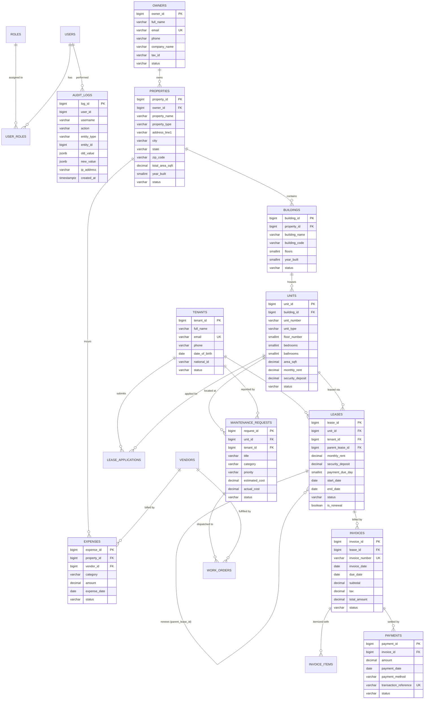

# PropLedger — Entity Relationship (ER) Diagram & Schema Reference

## Relational Cardinality Summary
- **Owner to Properties**: `1 : N` (One owner owns multiple commercial/residential properties)
- **Property to Buildings**: `1 : N` (A property complex contains one or more distinct buildings)
- **Building to Units**: `1 : N` (A physical building contains individual leasable unit suites)
- **Unit to Leases**: `1 : N` (A unit has multiple historical leases, but **only 1 active** lease at any given instant, enforced by database exclusion constraint)
- **Lease to Invoices**: `1 : N` (A monthly recurring rent schedule generates periodic billing invoices)
- **Invoice to Payments**: `1 : N` (An invoice can be settled by full payment or partial installments)
- **Unit to Maintenance Requests**: `1 : N` (Tickets and work orders logged against individual physical spaces)
