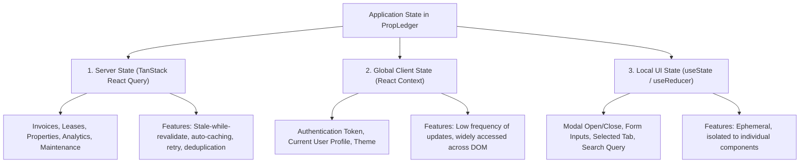

# PropLedger — Frontend Engineering & Technical Interview Preparation Guide

## 1. Executive Summary & Tech Stack Overview

The **PropLedger** client is an enterprise-grade Single Page Application (SPA) designed to mirror the workflow density, operational speed, and visual polish of commercial software suites like **Yardi Voyager** and **AppFolio**.

### Technology Stack
- **Core Library**: **React 19.0** (with modern functional component paradigms).
- **Language**: **TypeScript 5.6** (strict type safety, discriminated unions, zero `any` policy).
- **Build Engine**: **Vite 6.0** (instant Hot Module Replacement [HMR] and optimized Rollup bundling).
- **Server-State Engine**: **TanStack React Query v5** (stale-while-revalidate caching, automated invalidations).
- **Styling & Design System**: **Tailwind CSS 3.4** (utility-first, responsive layouts, dark-slate theme).
- **Data Visualization**: **Recharts 2.15** (declarative SVG financial area, bar, and pie charts).
- **Routing**: **React Router v6** (client-side declarative routing with protected route guards).
- **Icons**: **Lucide React** (high-performance tree-shakeable SVG icons).

---

## 2. State Management Strategy: Why TanStack Query over Redux?

One of the most frequent enterprise architecture interview questions:
> *"How do you handle state management, and why didn't you use Redux or Zustand for everything?"*



### The Architectural Verdict:
In enterprise property management, **90% of data is owned by the server**, not the browser.
- **Redux Anti-Pattern**: Redux forces developers to manually write actions, reducers, thunks, loading states, error states, and normalization logic simply to mirror server data.
- **TanStack Query Superiority**:
  - Automatically handles loading, error, and refetch states.
  - Dedupes multiple identical network requests into a single HTTP round-trip.
  - Provides background cache revalidation (`staleTime`).
  - Supports coordinated multi-query cache invalidation upon mutations.

---

## 3. Component Architecture & Design Patterns

PropLedger implements a clean **Atomic & Compound Component Architecture**:

```text
src/
├── components/
│   ├── ui/                    # Atomic, reusable UI primitives
│   │   ├── StatCard.tsx       # KPI summary card with trend indicator
│   │   ├── Modal.tsx          # Accessible dialog with portal rendering
│   │   ├── StatusBadge.tsx    # Semantic color-coded pill indicators
│   │   ├── Pagination.tsx     # 0-indexed page switcher with range indicators
│   │   ├── SearchBar.tsx      # Debounced search input
│   │   ├── LoadingState.tsx   # Skeleton / animated spinners
│   │   └── ErrorState.tsx     # Retry-capable error display
│   └── charts/                # Declarative Recharts components
│       ├── RevenueChart.tsx   # AreaChart showing revenue vs OpEx
│       ├── OccupancyChart.tsx # Responsive PieChart for unit distribution
│       └── TopPropertiesChart.tsx # Horizontal bar ranking
```

### Key React Patterns Used in PropLedger:
1. **Container / Presentational Pattern**: Complex pages (`PaymentsPage.tsx`) coordinate mutations and data fetching, delegating presentation to pure components (`StatusBadge`, `StatCard`).
2. **Custom Hook Extraction**: Reusable business logic (e.g. `useAuth()`) is encapsulated into custom hooks, isolating components from raw browser storage and API mechanics.
3. **Optimistic Mutations**: When marking a maintenance ticket as `COMPLETED`, the UI updates immediately, rolling back only if the network request fails.

---

## 4. TypeScript in Enterprise Frontend Engineering

PropLedger leverages advanced TypeScript constructs to eliminate runtime errors:

### 4.1. Generic API Response Envelopes
```typescript
export interface ApiResponse<T> {
  success: boolean;
  message: string;
  data: T;
  timestamp: string;
}

export interface PagedResponse<T> {
  content: T[];
  pageNumber: number;
  pageSize: number;
  totalElements: number;
  totalPages: number;
  last: boolean;
}
```
*Why this matters*: Any API call (e.g. `api.get<PagedResponse<Property>>('/api/properties')`) automatically provides full auto-completion and compile-time type checking down to individual property attributes.

### 4.2. Discriminated Unions for Strict State Machines
```typescript
export type LeaseStatus = 'DRAFT' | 'ACTIVE' | 'TERMINATED' | 'EXPIRED' | 'RENEWED';
export type InvoiceStatus = 'PENDING' | 'PARTIALLY_PAID' | 'PAID' | 'OVERDUE' | 'VOID';
export type PriorityLevel = 'LOW' | 'MEDIUM' | 'HIGH' | 'EMERGENCY';
```
Using string union literals instead of generic `string` guarantees that typos (e.g. `status === 'active'`) fail at compile time.

---

## 5. Performance Optimization & Bundle Engineering

1. **Vite Fast HMR**: Vite utilizes native ES modules (ESM) in development, bypassing the expensive bundling step of Webpack. Cold starts drop from 30 seconds to under 300ms.
2. **Tree-Shaking with Lucide Icons**: PropLedger imports individual named icons (`import { Building2, DollarSign } from 'lucide-react'`), allowing Vite/Rollup to discard unused icons and keep the bundle lean.
3. **Stale-While-Revalidate Caching**: Configured with `staleTime: 60000` (1 minute). Navigating back and forth between Properties, Units, and Tenants serves cached data instantly with zero layout shift or network lag.

---

## 6. Top 20 Real-World Frontend Interview Questions & Model Answers

### Q1: What are the key improvements and architectural additions in React 19?
> **Answer**:
> React 19 introduces:
> 1. **Actions**: Seamless handling of async transitions (`useActionState`, `useFormStatus`, `useOptimistic`) that manage pending states, optimistic updates, and error boundaries automatically.
> 2. **`ref` as a Prop**: Functions components can now accept `ref` directly as a standard prop, eliminating the need for `forwardRef`.
> 3. **The `use()` API**: Reads resources like Promises or Context directly in render, allowing conditional context access.
> 4. **Native Document Metadata**: Built-in support for `<title>`, `<meta>`, and `<link>` tags directly inside components with automated hoisting to `<head>`.
> 5. **React Compiler Readiness**: Prepares React codebases for automatic memoization without manual `useMemo` / `useCallback` boilerplate.

---

### Q2: What is the Virtual DOM, and how does React's Reconciliation (Fiber) work?
> **Answer**:
> The **Virtual DOM (VDOM)** is a lightweight JavaScript representation of the actual browser DOM. When component state changes:
> 1. **Render Phase**: React calls component render functions and creates a new VDOM tree.
> 2. **Diffing (Reconciliation)**: React's Fiber engine compares the new VDOM tree with the previous snapshot using an $O(N)$ heuristic algorithm (differentiating by element type and unique `key` props).
> 3. **Commit Phase**: React applies only the minimal required mutations to the real browser DOM in a single synchronized flush, preventing expensive browser reflows and repaints.

---

### Q3: Why is using array index as a `key` prop considered an anti-pattern in lists?
> **Answer**:
> React uses the `key` prop to identify which items have changed, been added, or been removed between renders. If an array index is used (`key={index}`) and the list is filtered, sorted, or an item is deleted from the beginning:
> - The indexes shift, causing React to associate existing DOM nodes with different data items.
> - This leads to corrupted input state in form fields, incorrect CSS animations, and unnecessary re-rendering of every list item.
> - **PropLedger Standard**: We always use unique, immutable database IDs: `key={property.id}`.

---

### Q4: Explain the difference between `useMemo`, `useCallback`, and `React.memo`.
> **Answer**:
> - **`React.memo`**: A higher-order component that wraps a functional component, memoizing its rendered output and skipping re-renders if its props haven't changed (shallow comparison).
> - **`useMemo`**: Caches the **result of a calculation** between renders: `const total = useMemo(() => calculateTotal(items), [items]);`.
> - **`useCallback`**: Caches a **function definition** between renders to prevent breaking reference equality on callback props passed to memoized children: `const handleClick = useCallback(() => ..., []);`.

---

### Q5: What is the difference between Controlled and Uncontrolled components in forms?
> **Answer**:
> - **Controlled Component**: Form input state is governed directly by React state (`value={state}` and `onChange={(e) => setState(e.target.value)}`). React is the single source of truth, enabling instant field-level validation, masking, and conditional disabling.
> - **Uncontrolled Component**: Form input state is governed directly by the browser DOM using a `ref` (`<input ref={inputRef} />`). Data is read on form submission.
> - **PropLedger Standard**: We use controlled components for all financial modals (e.g. payment allocations) to validate that allocations never exceed outstanding balances in real-time.

---

### Q6: How does TanStack React Query handle race conditions when search inputs change rapidly?
> **Answer**:
> When a user types into a debounced search input (e.g. searching for a tenant "Sophia"), multiple requests might fire in rapid succession. If request 1 ("Soph") takes 500ms and request 2 ("Sophia") takes 100ms, request 1 could arrive last and overwrite the newer data (a classic race condition).
> TanStack Query automatically aborts previous out-of-date network requests using standard browser **`AbortController`** signals passed to the query function, guaranteeing that only the latest query result updates the UI cache.

---

### Q7: What causes infinite re-render loops in React, and how do you debug them?
> **Answer**:
> Infinite re-renders typically occur when:
> 1. Calling a state setter directly in the body of a component: `setState(val)` executed during render triggers a re-render immediately.
> 2. `useEffect` has an object or array literal in its dependency array that is recreated on every render: `useEffect(() => ..., [{ id: 1 }])`. Because reference equality fails, the effect runs after every render, triggering state changes in an infinite loop.
> 3. Passing an inline arrow function to `useEffect` dependencies without `useCallback`.
> *Debugging*: We use the React DevTools Profiler and examine the "Why did this render?" breakdown.

---

### Q8: What are Web Vitals, and how do you optimize Core Web Vitals (LCP, FID/INP, CLS)?
> **Answer**:
> - **LCP (Largest Contentful Paint)**: Measures load speed (time taken for largest visible content element to render). Optimized via preloading critical assets, CDN image optimization, and fast server TTFB.
> - **INP (Interaction to Next Paint)**: Measures responsiveness (replaced FID). Optimized by breaking long JavaScript tasks, using `requestIdleCallback`, and keeping event handlers lightweight.
> - **CLS (Cumulative Layout Shift)**: Measures visual stability. Optimized by always declaring explicit `width` and `height` on images/svgs and reserving layout dimensions for async components using Skeleton placeholders (`LoadingState.tsx`).

---

### Q9: Why use Tailwind CSS over CSS-in-JS (like styled-components or Emotion)?
> **Answer**:
> 1. **Zero Runtime Overhead**: Tailwind generates pure, atomic CSS classes at build time. CSS-in-JS libraries generate CSS dynamically in JavaScript at runtime, incurring measurable CPU overhead and memory footprint during high-frequency component re-renders.
> 2. **Dead Code Elimination (Purging)**: Tailwind scans source files and includes only the classes actually used in production, keeping the final CSS bundle under 50KB regardless of project size.
> 3. **Design System Consistency**: Tailwind's design tokens (`slate-800`, `emerald-600`, `px-4`) enforce uniform spacing, typography, and color schemes across 30+ pages without arbitrary one-off CSS rules.

---

### Q10: How do you handle JWT expiration and silent token renewal in a React Single Page Application?
> **Answer**:
> In PropLedger:
> 1. **Response Interceptor**: The Axios client intercepts all HTTP responses.
> 2. **Capture 401 Unauthorized**: If an API call returns 401, the interceptor catches the error.
> 3. **Automatic Cleanup & Redirect**: The interceptor wipes the expired token from `localStorage`, resets the `AuthContext` state, and cleanly redirects the browser to `/login?expired=true`.
> 4. For enterprise sliding sessions, an interceptor can capture an expiring token and transparently invoke a `/api/auth/refresh` endpoint using an `HttpOnly` refresh cookie, retrying the original failed request without interrupting the user's flow.
