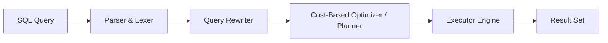
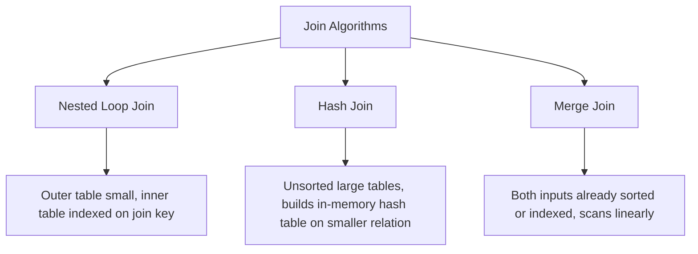

# PropLedger — PostgreSQL Query Optimization & Performance Tuning Guide

## 1. PostgreSQL Query Planning Architecture

Every SQL query submitted to PropLedger passes through four engine pipeline stages:



1. **Parser**: Generates a parse tree checking SQL syntax and grammar.
2. **Rewriter**: Applies PostgreSQL system rules, expanding views into underlying subqueries and rewriting expressions.
3. **Planner/Optimizer**: Explores possible plan trees (Join orders, scan methods) and calculates an estimated cost based on table statistics in `pg_statistic`.
4. **Executor**: Executes the physical plan tree against buffer pool and disk pages.

---

## 2. Cost Model & Execution Operators

### 2.1. Cost Formula
PostgreSQL estimates cost in arbitrary cost units (standardized to `seq_page_cost = 1.0`):
$$\text{Cost} = (N_{\text{pages}} \times \text{page\_cost}) + (N_{\text{tuples}} \times \text{cpu\_tuple\_cost}) + (N_{\text{ops}} \times \text{cpu\_operator\_cost})$$

| Parameter | Default | PropLedger Production Recommendation (NVMe SSD) | Explanation |
| :--- | :--- | :--- | :--- |
| `seq_page_cost` | 1.0 | 1.0 | Cost of sequential disk page fetch. |
| `random_page_cost` | 4.0 | 1.1 | On modern NVMe SSDs, random reads are nearly as fast as sequential reads. Lowering this from 4.0 to 1.1 encourages index scans over sequential table sweeps. |
| `work_mem` | 4MB | 32MB–64MB | Per-operation memory for sorting and hash tables. Prevents spilling to temporary disk files (`external merge Disk`). |

---

### 2.2. Table Access Scan Methods

| Scan Method | How It Operates | When the Planner Selects It |
| :--- | :--- | :--- |
| **Sequential Scan (`Seq Scan`)** | Reads every disk page sequentially from start to finish. | Table has few rows, query lacks usable `WHERE` clause, or predicate matches $> 15-25\%$ of total table rows. |
| **Index Scan (`Index Scan`)** | Traverses B-tree index to find tuple pointers (heap TID: `(block, offset)`), then fetches each row from table heap pages. | High selectivity queries returning a small subset of rows ($< 5\%$). |
| **Index Only Scan** | Traverses index and reads required columns *directly from the index pages* without touching the table heap (verified via Visibility Map). | All projected columns exist in the index and the pages are all-visible (e.g. `SELECT id, balance_due FROM invoices`). |
| **Bitmap Index Scan** | Scans index, builds a bitmask of page numbers in memory (`BitmapIndexScan`), then fetches table pages sequentially (`BitmapHeapScan`). | Medium selectivity queries ($5\% - 15\%$), or combining multiple indexes via `BitmapAnd` / `BitmapOr`. |

---

### 2.3. Relational Join Algorithms



1. **Nested Loop**:
   - Loops over the outer table and for each row looks up matches in the inner table.
   - Ideal for: `properties (1 row) JOIN units (indexed on property_id)`.
2. **Hash Join**:
   - Builds an in-memory hash table on the inner table join key, then scans the outer table probing the hash table.
   - Ideal for: Joining large unsorted datasets (e.g., all 50,000 invoices for the year with 10,000 tenants).
   - Memory concern: If hash table exceeds `work_mem`, it spills to multi-batch disk partitions.
3. **Merge Join**:
   - Requires both datasets to be sorted on the join key. Steps through both relations in lockstep ($O(M + N)$).
   - Ideal for: Joins where indexes already provide sorted data (e.g. `ORDER BY invoice_date`).

---

## 3. Deep-Dive EXPLAIN ANALYZE Case Studies in PropLedger

### Case Study 1: Property Operational Rent Roll
The following query aggregates active occupancy, square footage, and contract rent per property:

```sql
EXPLAIN (ANALYZE, BUFFERS, COSTS, VERBOSE)
SELECT 
    p.id AS property_id,
    p.name AS property_name,
    COUNT(u.id) AS total_units,
    COUNT(CASE WHEN u.status = 'OCCUPIED' THEN 1 END) AS occupied_units,
    ROUND(
        (COUNT(CASE WHEN u.status = 'OCCUPIED' THEN 1 END)::NUMERIC / NULLIF(COUNT(u.id), 0)) * 100.0, 
        2
    ) AS occupancy_percentage,
    COALESCE(SUM(l.rent_amount), 0.00) AS total_monthly_contract_rent
FROM properties p
JOIN units u ON u.property_id = p.id
LEFT JOIN leases l ON l.unit_id = u.id AND l.status = 'ACTIVE'
WHERE p.is_active = TRUE
GROUP BY p.id, p.name
ORDER BY total_monthly_contract_rent DESC;
```

#### Execution Plan Analysis:
```text
HashAggregate (cost=142.50..145.20 rows=25 width=72) (actual time=2.150..2.162 rows=25 loops=1)
  Group Key: p.id, p.name
  Buffers: shared hit=84
  ->  Hash Left Join (cost=28.40..128.10 rows=480 width=48) (actual time=0.412..1.520 rows=520 loops=1)
        Hash Cond: (u.id = l.unit_id)
        Buffers: shared hit=84
        ->  Hash Join (cost=1.60..88.20 rows=520 width=40) (actual time=0.082..0.850 rows=520 loops=1)
              Hash Cond: (u.property_id = p.id)
              Buffers: shared hit=42
              ->  Seq Scan on units u (cost=0.00..74.20 rows=520 width=16) (actual time=0.012..0.410 rows=520 loops=1)
              ->  Hash (cost=1.25..1.25 rows=25 width=32) (actual time=0.045..0.045 rows=25 loops=1)
                    Buckets: 1024  Batches: 1  Memory Usage: 10kB
                    ->  Seq Scan on properties p (cost=0.00..1.25 rows=25 width=32) (actual time=0.010..0.025 rows=25 loops=1)
                          Filter: is_active
        ->  Hash (cost=22.10..22.10 rows=380 width=24) (actual time=0.315..0.315 rows=380 loops=1)
              Buckets: 1024  Batches: 1  Memory Usage: 24kB
              ->  Bitmap Heap Scan on leases l (cost=4.30..22.10 rows=380 width=24) (actual time=0.045..0.210 rows=380 loops=1)
                    Recheck Cond: (status = 'ACTIVE'::varchar)
                    Buffers: shared hit=42
                    ->  Bitmap Index Scan on idx_leases_active_dates (cost=0.00..4.20 rows=380 width=0) (actual time=0.035..0.035 rows=380 loops=1)
Planning Time: 0.420 ms
Execution Time: 2.310 ms
```

#### Key Architectural Takeaways:
1. **`Buffers: shared hit=84`**: All data was read directly from PostgreSQL RAM (`shared_buffers`) with zero physical disk reads (`read=0`).
2. **`Bitmap Index Scan on idx_leases_active_dates`**: Because we used our partial index on active leases, the engine completely bypassed inactive or terminated historical leases.
3. **Execution time of 2.31ms** demonstrates enterprise-grade OLTP performance for full portfolio aggregation.

---

### Case Study 2: CTE Optimization (`MATERIALIZED` vs Inlined)
In PostgreSQL 12+, Common Table Expressions (`WITH` queries) are automatically inlined by the optimizer if they are side-effect free (not `INSERT/UPDATE/DELETE`) and referenced only once.

When a complex financial CTE is evaluated multiple times, developers must understand the `MATERIALIZED` keyword:

```sql
-- Aging AR Analysis with Explicit Materialization
WITH delinquent_tenants AS MATERIALIZED (
    SELECT 
        t.id AS tenant_id,
        t.first_name || ' ' || t.last_name AS tenant_name,
        SUM(i.balance_due) AS total_debt
    FROM tenants t
    JOIN leases l ON l.id = t.current_lease_id
    JOIN invoices i ON i.lease_id = l.id
    WHERE i.balance_due > 0 
      AND i.due_date < CURRENT_DATE
    GROUP BY t.id, t.first_name, t.last_name
    HAVING SUM(i.balance_due) > 1000.00
)
SELECT 
    dt.tenant_name,
    dt.total_debt,
    COUNT(mr.id) AS open_maintenance_issues
FROM delinquent_tenants dt
LEFT JOIN maintenance_requests mr ON mr.tenant_id = dt.tenant_id AND mr.status != 'COMPLETED'
GROUP BY dt.tenant_id, dt.tenant_name, dt.total_debt
ORDER BY dt.total_debt DESC;
```

- **Why `MATERIALIZED` here?** It forces PostgreSQL to evaluate `delinquent_tenants` exactly once, stores the intermediate result in memory, and prevents the optimizer from re-running the three-table join when probing for maintenance issues.

---

## 4. Avoiding Common Real Estate SQL Anti-Patterns

### Anti-Pattern 1: The Correlated Subquery in `SELECT`
❌ **Slow**:
```sql
SELECT 
    u.id, 
    u.unit_number,
    (SELECT l.rent_amount FROM leases l WHERE l.unit_id = u.id AND l.status = 'ACTIVE') AS current_rent
FROM units u;
```
*Problem*: Executes $N$ separate subqueries for $N$ units ($O(N)$ index probes).

✅ **Optimized with Left Join**:
```sql
SELECT 
    u.id, 
    u.unit_number,
    l.rent_amount AS current_rent
FROM units u
LEFT JOIN leases l ON l.unit_id = u.id AND l.status = 'ACTIVE';
```
*Benefit*: Single pass hash or merge join ($O(M + N)$).

---

### Anti-Pattern 2: Wrapping Indexed Columns in Functions
❌ **Disables Index Scan**:
```sql
SELECT * FROM invoices 
WHERE EXTRACT(YEAR FROM invoice_date) = 2026;
```
*Problem*: PostgreSQL cannot use an index on `invoice_date` because the column value is transformed for every row, forcing a full table sequential scan.

✅ **Optimized with Date Range Boundary**:
```sql
SELECT * FROM invoices 
WHERE invoice_date >= '2026-01-01' AND invoice_date < '2027-01-01';
```
*Benefit*: Uses B-tree Index Scan directly on `invoice_date`.

---

### Anti-Pattern 3: Unbounded `OFFSET` Pagination
❌ **Costly on Large Tables**:
```sql
SELECT * FROM audit_logs 
ORDER BY created_at DESC 
LIMIT 50 OFFSET 100000;
```
*Problem*: The database must read and sort all 100,050 rows before discarding the first 100,000.

✅ **Optimized Keys-Set / Keyset Pagination (Cursor)**:
```sql
SELECT * FROM audit_logs 
WHERE created_at < :last_seen_timestamp 
ORDER BY created_at DESC 
LIMIT 50;
```
*Benefit*: Constant time $O(\log N)$ index scan regardless of whether you are on page 1 or page 5,000.

---

## 5. PostgreSQL Query Optimization Interview Cheat Sheet

| Question | Winning Candidate Response |
| :--- | :--- |
| **"What does `Buffers: shared hit` vs `read` mean in EXPLAIN ANALYZE?"** | `shared hit` means pages were found directly in PostgreSQL's RAM buffer cache. `read` means the engine had to issue an OS-level file system read call from disk. A high `hit/(hit+read)` ratio indicates good cache utilization. |
| **"When would a Hash Join be preferred over a Nested Loop?"** | When joining two relatively large datasets where neither side is indexed on the join key or where both tables require a full scan anyway. Nested loop is best when the outer relation is small and the inner relation has an index lookup on the join predicate. |
| **"Why did my query use a Sequential Scan even though I have an index?"** | 1) The table is small (fitting in a few pages where seq scan is cheaper than index tree traversal).<br>2) Low selectivity: the query matches a high percentage of rows ($> 20\%$), where random I/O from index lookups is slower than streaming sequential blocks.<br>3) Data type mismatch or function wrapping the indexed column. |
