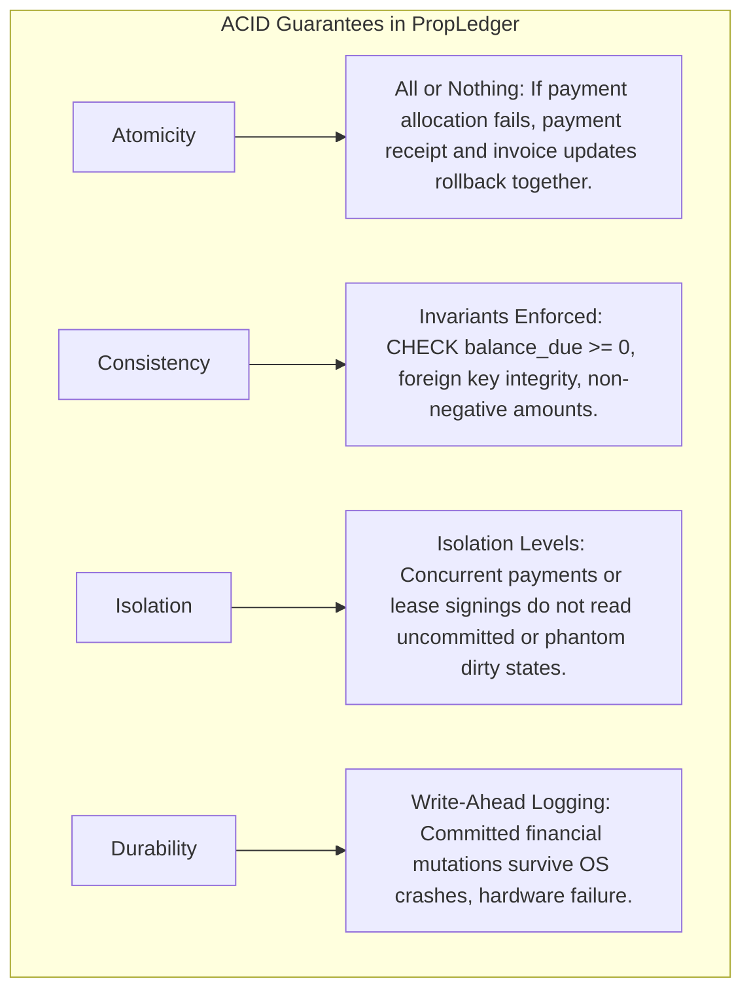
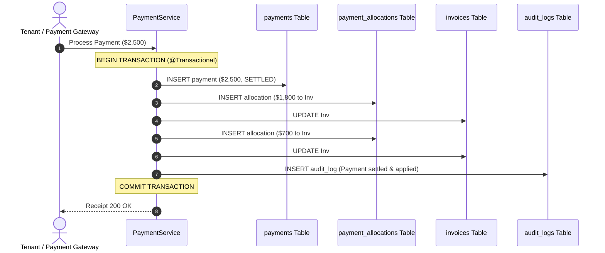

# PropLedger — Transaction Management & ACID Implementation

## 1. Enterprise ACID Requirements in Property Operations

In enterprise property management systems (e.g. Yardi Voyager, RealPage), multi-table state transitions must execute with **strict ACID guarantees**. A partial failure in billing or leasing causes severe financial discrepancy, audit non-compliance, or tenant legal liability.



---

## 2. Real Estate Transaction Workflows & Boundaries

### 2.1. Workflow 1: Multi-Invoice Payment Allocation
**Scenario**: A tenant pays \$2,500 via ACH. The tenant owes:
- Invoice #1: \$1,800 (Past due rent + late fee)
- Invoice #2: \$700 (Current month utility charge)



#### Failure Scenario & Rollback:
If an error occurs at step 5 (e.g., database constraint violation or network timeout), Spring Boot triggers an **unconditional rollback**:
- The payment record is purged.
- The first allocation is revoked.
- Invoice balances remain untouched.
- The tenant is not charged without credit.

---

### 2.2. Workflow 2: Lease Execution & Unit Status Synchronization
When a new lease contract transitions from `DRAFT` to `ACTIVE`:
1. `leases.status` updated to `'ACTIVE'`.
2. Unit status in `units.status` transitioned from `'AVAILABLE'` to `'OCCUPIED'`.
3. Initial security deposit and first-month rent invoices generated in `invoices` and `invoice_items`.
4. Tenant's `current_lease_id` pointer updated in `tenants`.
5. Audit event written to `audit_logs`.

All 5 operations occur inside a single atomic database transaction.

---

## 3. PostgreSQL Isolation Levels & Concurrency Anomalies

PostgreSQL implements Multi-Version Concurrency Control (MVCC) to provide non-blocking reads and isolated transactions.

### 3.1. Standard ANSI SQL Isolation Levels & Phenomena

| Isolation Level | Dirty Read | Non-Repeatable Read | Phantom Read | Serialization Anomaly | PropLedger Usage |
| :--- | :--- | :--- | :--- | :--- | :--- |
| **Read Uncommitted** | Impossible in PG | Possible | Possible | Possible | *(PG treats as Read Committed)* |
| **Read Committed** | **Prevented** | Possible | Possible | Possible | **Default for 90% of OLTP endpoints** |
| **Repeatable Read** | **Prevented** | **Prevented** | **Prevented** | Possible | **Used for Financial Rent Roll & Year-End Tax Reports** |
| **Serializable (SSI)** | **Prevented** | **Prevented** | **Prevented** | **Prevented** | **Used for Critical Ledger Settlement & Bank Reconciliation** |

### 3.2. Concrete Real Estate Anomaly Examples:

#### 1. Non-Repeatable Read in Billing:
- **Transaction A** queries a unit's rent amount (\$2,000) to prepare monthly billing.
- Simultaneously, **Transaction B** updates rent to \$2,200 due to lease escalation and commits.
- **Transaction A** re-reads the row to calculate invoice tax and sees \$2,200, generating inconsistent line items.
- *Mitigation*: Run billing generation in `@Transactional(isolation = Isolation.REPEATABLE_READ)`.

#### 2. Phantom Read in Unit Availability:
- **Transaction A** queries all available units in Building 1 (`COUNT = 5`).
- **Transaction B** creates a new unit in Building 1 and commits.
- **Transaction A** re-runs the count and sees 6 units.
- *Mitigation*: PostgreSQL's `REPEATABLE READ` snapshot prevents phantom reads natively using snapshot isolation.

#### 3. Write Skew (Serialization Anomaly):
- A property policy states: *"At least one property manager must be on-call per building at all times."*
- Manager 1 and Manager 2 both submit an off-duty request at the exact same millisecond.
- Both transactions check: `SELECT COUNT(*) FROM on_call_managers WHERE building_id = 1`. Both see `2`.
- Both submit: `UPDATE on_call_managers SET status = 'OFF_DUTY' WHERE id = :my_id`.
- Under `READ COMMITTED` or `REPEATABLE READ`, both commit successfully, leaving **zero** managers on duty!
- *Mitigation*: Use `@Transactional(isolation = Isolation.SERIALIZABLE)` or explicit pessimistic locking (`SELECT ... FOR UPDATE`).

---

## 4. Spring Boot `@Transactional` Best Practices & Gotchas

### 4.1. Explicit Rollback Boundaries
By default in Spring, transactions only rollback on unchecked exceptions (`RuntimeException` and `Error`). Checked exceptions (`SQLException`, `IOException`, `BusinessRuleException`) do not trigger a rollback unless explicitly declared!

PropLedger mandates:
```java
@Transactional(
    propagation = Propagation.REQUIRED,
    isolation = Isolation.READ_COMMITTED,
    rollbackFor = { Exception.class }
)
public PaymentDto processPayment(PaymentRequest request) { ... }
```

### 4.2. The Spring AOP Proxy Self-Invocation Trap
In Spring Boot, `@Transactional` is implemented via dynamic AOP proxies. If method A calls method B inside the *same class*:
```java
@Service
public class LeaseService {
    
    public void publicMethodWithoutTx() {
        // Internal call!
        this.executeLeaseAtomic(); // BUG: @Transactional is completely BYPASSED!
    }

    @Transactional
    public void executeLeaseAtomic() { ... }
}
```
**Why it fails**: The internal call uses the `this` pointer directly, bypassing the Spring CGLIB proxy. No transaction is ever started!
**PropLedger Standard**: Transactional entry points are always accessed via external bean injection or isolated helper components (`LeaseTransactionCoordinator`).

---

## 5. PostgreSQL Write-Ahead Logging (WAL) & Durability

How PostgreSQL guarantees durability ($D$ in ACID):
1. When a transaction modifies a table (e.g. `UPDATE invoices`), the changes are made in RAM inside the `shared_buffers`.
2. Before the transaction reports `COMMIT SUCCESS` to Spring Boot, a cryptographic record of the change is written sequentially to the **Write-Ahead Log (WAL)** on disk (`pg_wal`).
3. If power fails or the database crashes immediately afterwards, the engine replays the WAL on restart, reconstructing the committed state into heap pages.
4. Dirty memory pages are lazily flushed to disk by the background `checkpointer` process without stalling incoming user transactions.

---

## 6. Interview Q&A on Transactions

| Interview Question | Senior Engineer Answer |
| :--- | :--- |
| **"Why not set the entire application to `SERIALIZABLE` isolation?"** | Serializable Snapshot Isolation (SSI) tracks read/write dependencies in a lock graph. When concurrent transactions conflict (e.g. high-frequency updates on the same property), the engine aborts the transaction with `could not serialize access due to read/write dependencies among transactions (SQLState: 40001)`. The application must implement retry loops. For high-throughput OLTP, `READ COMMITTED` with targeted row-level locking (`SELECT FOR UPDATE`) delivers vastly superior throughput without abort overhead. |
| **"What happens if an external payment gateway webhook times out after charging the credit card?"** | We use an **idempotency key** (`payment_reference`) with a unique constraint in the `payments` table. If the gateway retries the webhook, the database rejects the duplicate with a constraint violation, ensuring the tenant is never credited twice for the same card charge. |
