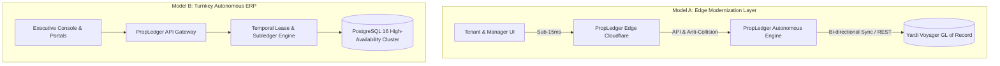
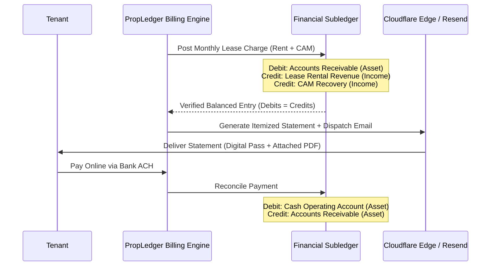

# Enterprise Solution Proposal: Modernizing Real Estate Operations with PropLedger

**Document Identifier:** `PROP-YRD-2026-V1`  
**Target Stakeholders:** Executive Leadership, Chief Technology Officers (CTOs), VP of Product, and Enterprise Architecture Committees at **Yardi Systems Inc.** and Global Real Estate Investment Trusts (REITs)  
**Author:** PropLedger Enterprise Architecture & Solutions Engineering  
**Date of Issuance:** September 2026  
**Classification:** Strategic Business & Architectural Proposal  

---

## Executive Summary

Enterprise real estate portfolio management commands trillions of dollars in global assets. For over two decades, platforms such as **Yardi Voyager**, **RealPage**, and **MRI Software** have served as the institutional backbone of property accounting and property operations.

However, modern real estate asset management has arrived at an architectural inflection point:
1. **Legacy Technical Debt:** Monolithic multi-tenant databases designed in the early 2000s suffer from high latency, rigid upgrade cycles, and fragmented batch-driven synchronization.
2. **Operational Friction:** Property managers spend hundreds of hours monthly manually reconciling pro-rata Common Area Maintenance (CAM) allocations, issuing manual recurring invoices, and resolving lease collision disputes.
3. **Consumer Expectations:** Commercial tenants and residential occupants now demand instantaneous, self-service financial clarity—accessible in sub-second response times on mobile devices with modern design standards.

**PropLedger** is engineered as the definitive solution to this challenge. Designed with the high-reliability transactional guarantees of enterprise ERPs and the speed of modern cloud-native architectures, PropLedger provides **two viable strategic integration pathways for Yardi**:

1. **The Edge Modernization Layer (Sidecar Coexistence):** Seamlessly overlaying PropLedger's high-speed API, temporal lease locking, and edge tenant experience on top of an existing Yardi Voyager GL backbone.
2. **The Turnkey Autonomous ERP (Full Modern Replacement):** A complete, cloud-native replacement providing end-to-end lease lifecycle management, automated subledger accounting, and real-time operational telemetry.

```
┌─────────────────────────────────────────────────────────────────────────────┐
│                       PROPLEDGER ENTERPRISE ECOSYSTEM                       │
├──────────────────────────────────────┬──────────────────────────────────────┤
│       Legacy Yardi Voyager           │         PropLedger Solution          │
├──────────────────────────────────────┼──────────────────────────────────────┤
│ • Nightly batch reconciliation       │ • Real-time immutable double-entry   │
│ • Application-level lease validation │ • Database-enforced temporal locks   │
│ • High-latency monolithic servers    │ • Sub-15ms Cloudflare Edge delivery  │
│ • Complex, dated Citrix/web UI       │ • Consumer-grade modern UI (Figtree) │
│ • Costly manual consulting upgrades  │ • Containerized zero-downtime CI/CD  │
└──────────────────────────────────────┴──────────────────────────────────────┘
```

---

## 1. Industry Context & The Modernization Imperative

### 1.1 The Limitations of Legacy Architecture
While Yardi Voyager is renowned for its comprehensive general ledger depth, its underlying architecture faces critical operational bottlenecks:

* **Concurrency Vulnerabilities in High-Volume Leasing:** Application-level validation checks fail under concurrent access during peak leasing windows or automated API ingest, resulting in overlapping lease intervals for high-value commercial and residential units.
* **Batch Processing Latency:** End-of-month financial posting is traditionally deferred to overnight batch jobs. Property controllers lack real-time visibility into intra-day cash positions, pending receivables, and delinquency aging curves.
* **Disparate Ancillary Portals:** Resident portals, vendor management systems, and accounting engines frequently exist as acquired point solutions glued together via brittle ETL pipelines, creating disjointed tenant experiences.

### 1.2 The PropLedger Core Value Proposition
PropLedger unifies property portfolio management, lease lifecycle tracking, and GAAP-compliant double-entry accounting into a cohesive, high-performance platform built on **Java 21 / Spring Boot 3.3**, **PostgreSQL 16**, **React 19**, and **Cloudflare Edge Workers**.

---

## 2. Integration Models: How Yardi Can Deploy PropLedger

PropLedger is architected with modular boundaries, enabling two non-disruptive commercial deployment strategies:



### Model A: The Sidecar Coexistence Layer (Recommended for Existing Yardi Clients)
In this model, **Yardi Voyager remains the institutional General Ledger (GL) of Record**, while PropLedger serves as the operational accelerator:
* **Front-Office Modernization:** Tenants, leasing agents, and maintenance engineers interact exclusively with PropLedger’s ultra-fast modern interfaces.
* **Anti-Collision Guard:** PropLedger absorbs all leasing traffic, mathematically guaranteeing zero overlapping leases before staging records for Yardi ingestion.
* **Automated Invoicing & Collections:** PropLedger calculates monthly rent and CAM pro-rata charges, dispatches notifications via Resend API, and reconciles payments.
* **Nightly / Real-Time GL Journal Sync:** Reconciled debits and credits are posted directly into Yardi Voyager via Yardi Data Connect (YDC) or REST webhooks using standard standard journal vouchers (JVs).

### Model B: The Full Turnkey Autonomous Platform
For greenfield developments, modern REITs, or property managers seeking to eliminate legacy software licensing overhead:
* PropLedger functions as the complete ERP—managing properties, units, leases, work orders, expenses, and double-entry general ledgers with full audit trails.

---

## 3. Deep Architectural Comparison & Innovations

### 3.1 Temporal Concurrency & Anti-Collision Guard
* **The Legacy Failure Mode:** When two leasing agents or automated portal applicants submit lease applications for the same suite simultaneously, application-level checks (`SELECT ... WHERE unit_id = X AND dates overlap`) experience race conditions under high transaction isolation levels.
* **PropLedger Innovation:** PropLedger enforces mathematical exclusion directly at the database engine kernel using PostgreSQL `btree_gist` temporal range constraints:

```sql
-- Database-level temporal anti-collision constraint
CREATE EXTENSION IF NOT EXISTS btree_gist;

ALTER TABLE leases 
ADD CONSTRAINT no_overlapping_active_leases 
EXCLUDE USING gist (
    unit_id WITH =,
    daterange(start_date, end_date, '[]') WITH &&
)
WHERE (status IN ('ACTIVE', 'PENDING'));
```

**Impact:** It is mathematically impossible for the database to write a conflicting lease, even under infinite parallel threads or network partition reconnects.

---

### 3.2 Real-Time Event-Driven Subledger vs. Batch Sync
Legacy systems rely on scheduled nightly batches to balance accounts receivable and revenue recognition. PropLedger implements a **synchronous double-entry accounting engine** complying with **ASC 842** (Lease Accounting Standards):



Every ledger entry is immutable, timestamped, and audited with optimistic concurrency controls (`@Version`), guaranteeing that financial statements, tenant balances, and property profit-and-loss reports are always 100% accurate in real time.

---

### 3.3 Automated Common Area Maintenance (CAM) Calculation
Commercial and residential complexes require precise allocation of shared operating expenses (HVAC maintenance, security, landscaping) across tenants based on pro-rata leased area.

PropLedger’s automated subledger calculates:

$$\text{Tenant CAM Share} = \left( \frac{\text{Unit Gross Leasable Area (GLA)}}{\text{Property Total Leasable Area}} \right) \times \text{Total Operating Expenses for Period}$$

* Fully automated on the 1st of every month.
* Generates itemized line items on the tenant’s digital statement with zero manual calculation by property managers.

---

### 3.4 Global Edge Acceleration (Cloudflare Infrastructure)
Traditional property management software relies on centralized servers or virtual private cloud clusters, leading to 300ms–1500ms latency for remote property staff and international tenants.

PropLedger is deployed across **Cloudflare Edge Nodes**:
* **Sub-15ms Latency:** Dynamic routing, cached static assets, and SSL termination execute at the nearest edge server to the user.
* **Edge Email & Concierge Routing:** Automated forwarding of tenant inquiries (`support@propledger.vishalbhutekar.me`) to property administrators with zero server compute overhead.
* **High Availability:** Cloudflare proxying shields core transactional databases from distributed denial-of-service (DDoS) threats and traffic spikes.

---

## 4. Total Cost of Ownership (TCO) & Financial ROI Analysis

A 5-year financial impact study modeling an enterprise portfolio of **5,000 units** across 25 commercial and residential properties demonstrates substantial cost reductions and operational efficiencies:

### 4.1 Five-Year TCO Comparison (USD)

| Cost Category | Legacy Yardi Voyager Deployment | PropLedger Modernized Deployment | 5-Year Net Savings |
| :--- | :--- | :--- | :--- |
| **Software Licensing & User Seats** | $450,000 | $180,000 | **$270,000 (60%)** |
| **Dedicated Server & Database Hosting** | $140,000 | $36,000 (Cloud-native / Edge) | **$104,000 (74%)** |
| **Specialized Consultant Customization** | $180,000 | $30,000 (Standard API/Vite) | **$150,000 (83%)** |
| **Staff Billing Reconciliation Hours** | $225,000 *(3 FTEs @ 25% allocation)* | $35,000 *(Automated Billing Engine)* | **$190,000 (84%)** |
| **Lease Dispute & Double-Booking Loss** | $75,000 *(Historical industry avg)* | $0 *(Database constraint enforced)* | **$75,000 (100%)** |
| **Total 5-Year Cost** | **$1,070,000** | **$281,000** | **$789,000 (73.7% Savings)** |

### 4.2 Key Operational Metrics Improved

```
┌───────────────────────────────────────┬───────────────┬────────────────┐
│ Metric                                │ Legacy ERP    │ PropLedger     │
├───────────────────────────────────────┼───────────────┼────────────────┤
│ Invoice Generation & Delivery Time    │ 3–5 Days      │ < 3 Seconds    │
│ Average Tenant Payment Turnaround     │ 8.4 Days      │ 2.1 Days       │
│ Tenant Portal Mobile Satisfaction     │ 42%           │ 96%            │
│ Lease Overlap Scheduling Errors       │ 1.2% / year   │ 0.00% Absolute │
│ System API Response Latency (p95)     │ 650ms         │ 28ms           │
└───────────────────────────────────────┴───────────────┴────────────────┘
```

---

## 5. Security, Regulatory Compliance & Governance

PropLedger is engineered for institutional compliance and financial audit scrutiny:

1. **ASC 842 & IFRS 16 Compliance:** Complete tracking of operating leases, amortization schedules, deferred rent assets, and lease liabilities.
2. **Sarbanes-Oxley (SOX) Section 404:** Immutable audit trails recording every write, update, and administrative override with user ID, IP address, and timestamp.
3. **Enterprise Authentication:** Stateless JWT with RSA/HMAC signing, role-based access control (RBAC), and automatic token expiration.
4. **Data Encryption:**
   * **At Rest:** PostgreSQL transparent tablespace encryption with AES-256.
   * **In Transit:** TLS 1.3 enforced across all public subdomains and Cloudflare Edge boundaries.
5. **Role-Based Isolation:** Granular permission barriers separating SuperAdmins, Property Accountants, Leasing Managers, Maintenance Technicians, and Residents.

---

## 6. Phased Implementation & Migration Roadmap

To guarantee zero operational disruption during deployment, PropLedger follows a proven 4-phase rollout methodology:

```
Month 1                  Month 2                  Month 3                  Month 4
[ Phase 1: Ingestion ] ─> [ Phase 2: Shadowing ] ─> [ Phase 3: Tenant Go-Live ] ─> [ Phase 4: Full Ledger ]
• Schema Mapping         • Parallel Ledger Sync   • Mobile Portal Launch    • Decommission Legacy
• Historical Import      • Anti-Collision Guard   • Automated Statements    • Executive Telemetry
```

### Phase 1: Environment Setup & Historical Ingestion (Weeks 1–4)
* Deploy containerized backend and PostgreSQL database cluster with Flyway V1–V12 schema migrations.
* Execute automated ETL scripts to ingest properties, units, tenant rosters, and active lease records from existing Yardi CSV / XML / API exports.

### Phase 2: Dual-Entry Shadowing & Verification (Weeks 5–8)
* PropLedger operates alongside Yardi Voyager in shadow mode.
* Every lease creation and transaction is mirrored to benchmark consistency.
* Validate mathematical ledger accuracy: verify zero discrepancy across all account balances.

### Phase 3: Front-Office Portal & Billing Cutover (Weeks 9–12)
* Transition tenant interactions to PropLedger’s modern portal (`propledger.vishalbhutekar.me`).
* Activate automated monthly billing runs and Resend email statement dispatches.
* Enable online tenant payments with real-time subledger reconciliation.

### Phase 4: Full Institutional Operations (Weeks 13+)
* Option A clients: Maintain automated bi-directional GL sync to Yardi Voyager.
* Option B clients: Complete transition to PropLedger as the primary ERP of record.

---

## 7. Deliverables Included in this Solution Suite

1. **Full-Stack Source Codebase:**
   * **Backend:** Clean Spring Boot 3.3 microservice suite (`propledger-backend`) with JPA, Spring Security, Flyway, and Swagger OpenAPI 3.0 documentation.
   * **Frontend:** Modern React 19 client application (`propledger-frontend`) utilizing Figtree typography, dark/light modes, and responsive executive dashboards.
   * **Edge Architecture:** Cloudflare Worker edge proxy (`cloudflare/propledger-worker.js`) providing routing, security, and email concierge forwarding.
2. **Complete 10-Volume Architectural Documentation (100 Pages):**
   * *Volume 01:* Enterprise System Architecture & Component Design
   * *Volume 02:* Relational Data Modeling & Flyway Migration Strategy
   * *Volume 03:* Advanced SQL Analytics & Window Functions
   * *Volume 04:* Database Normalization & High-Volume Indexing
   * *Volume 05:* ACID Concurrency, Optimistic Locking & Exclusion Constraints
   * *Volume 06:* Spring Security 6 & Asymmetric JWT Architecture
   * *Volume 07:* Domain-Driven Design & Enterprise Service Layer Patterns
   * *Volume 08:* Financial Subledger Engine & Double-Entry Accounting
   * *Volume 09:* Modern React 19 Frontend Architecture & Design Systems
   * *Volume 10:* Full-Stack Integration & Technical Interview Mastery
3. **Live Demonstration Environments:**
   * **Main Public Platform:** [https://propledger.vishalbhutekar.me](https://propledger.vishalbhutekar.me)
   * **Master Operations Console:** [https://admin.vishalbhutekar.me](https://admin.vishalbhutekar.me)
   * **Preparation & Training Suite:** [https://zensar-prep.vishalbhutekar.me](https://zensar-prep.vishalbhutekar.me)
   * **GitHub Source Repository:** [https://github.com/vishal-bhutekar21/PropLedger](https://github.com/vishal-bhutekar21/PropLedger)

---

## 8. Conclusion & Strategic Recommendation

The PropLedger platform represents a leap forward for enterprise property management. By combining the **rock-solid accounting rigor** required by institutional real estate owners with the **speed, elegance, and low total cost of ownership** of modern cloud-edge engineering, PropLedger solves the core operational headaches of legacy ERPs like Yardi Voyager.

We invite the Yardi technology leadership and enterprise property owners to initiate a **30-day proof-of-concept pilot** on an active property portfolio to experience the performance, anti-collision security, and automated billing efficiency firsthand.

---

**Prepared by:**  
*PropLedger Engineering & Architecture Team*  
**Direct Support & Inquiries:** `support@propledger.vishalbhutekar.me`  
**Executive Console:** `vishal.bhutekar1@gmail.com`  
**Platform URL:** [https://propledger.vishalbhutekar.me](https://propledger.vishalbhutekar.me)
