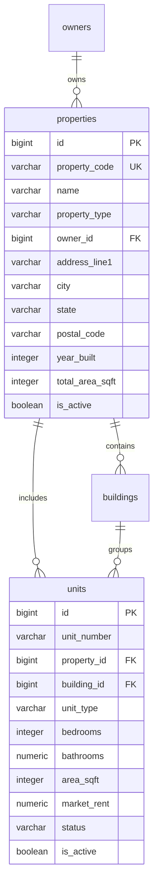

# Module 02: Property, Building & Unit Asset Hierarchy

## 1. Module Overview & Business Context
In commercial and residential real estate software (such as Yardi Voyager, RealPage, and MRI Software), the **Asset Hierarchy** forms the core backbone of the entire application. All downstream operations—leases, billing, maintenance, and investor financial returns—map directly back to physical spaces.

PropLedger implements a strict, 3-tier physical asset model:
1. **Property (Asset)**: The overarching legal or commercial development (e.g. "Grandview Heights", "Bellevue Commercial Center").
2. **Building (Structure)**: Physical structures or towers within a campus (e.g. "Tower A", "South Annex").
3. **Unit (Rentable Space)**: The individual rentable dwelling or commercial suite (e.g. "Apt 402", "Suite 100").

---

## 2. Technology Stack & Frameworks

| Layer | Framework / Technology | Role in Asset Hierarchy |
| :--- | :--- | :--- |
| **Backend Core** | Spring Boot 3.3.4 (Java 21) | REST Controllers (`PropertyController`, `UnitController`), Services (`PropertyService`, `UnitService`), and DTO validation. |
| **Persistence** | Spring Data JPA / Hibernate 6.5 | Object-Relational Mapping, entity relationship navigation, and pagination. |
| **Database Engine** | PostgreSQL 16 | Relational constraints, composite uniqueness, spatial attributes, and foreign keys. |
| **Frontend Core** | React 19 + TypeScript | UI pages: `PropertiesPage.tsx`, `PropertyDetailPage.tsx`, `UnitsPage.tsx`. |
| **Data Fetching** | TanStack React Query v5 | Manages asynchronous server state, automatic caching, and refetch on mutation. |
| **UI & Styling** | Tailwind CSS 3.4 + Lucide Icons | Responsive enterprise dashboard layout, stat cards, filtering controls, and status badges. |

---

## 3. API Specifications & Data Contracts

### 3.1. Properties API (`/api/properties`)
- `GET /api/properties`: Supports pagination (`page`, `size`), sorting (`sort=name,asc`), and query filtering (`search=grandview`).
- `GET /api/properties/{id}`: Returns complete property metadata, associated buildings, and aggregated unit counts.
- `POST /api/properties`: Creates a new property asset.
  - **Sample Request**:
    ```json
    {
      "propertyCode": "PROP-BVT-01",
      "name": "Bellevue Terrace",
      "propertyType": "RESIDENTIAL_MULTIFAMILY",
      "ownerId": 1,
      "addressLine1": "10400 NE 4th St",
      "city": "Bellevue",
      "state": "WA",
      "postalCode": "98004",
      "yearBuilt": 2021,
      "totalAreaSqft": 125000
    }
    ```
- `PUT /api/properties/{id}`: Updates property details.
- `DELETE /api/properties/{id}`: Soft-deletes property (`is_active = false`).

### 3.2. Units API (`/api/units`)
- `GET /api/units`: Filterable by `propertyId`, `status` (`AVAILABLE`, `OCCUPIED`, `MAINTENANCE`), `bedrooms`, and `maxRent`.
- `GET /api/units/{id}`: Returns unit specifications, current active lease, and maintenance history.
- `POST /api/units`: Adds a new unit to a property.
- `PUT /api/units/{id}`: Updates unit specifications or status.

---

## 4. Database Schema & Relational Design



### Relational Invariants & Constraints
1. **Composite Uniqueness**:
   `CONSTRAINT uq_units_prop_bldg_number UNIQUE (property_id, building_id, unit_number)`
   *Guarantees*: You can have "Unit 101" in Building A and "Unit 101" in Building B, but never two identical unit numbers inside the same building.
2. **Restricted Deletion**:
   `properties -> units` uses `ON DELETE RESTRICT`. A property cannot be deleted if active units exist.

---

## 5. Performance Engineering & Indexing

1. **Composite Search Index**:
   ```sql
   CREATE INDEX idx_units_prop_status_rent ON units (property_id, status, market_rent);
   ```
   Supports instant filtering when property managers search for all available units ordered by rent.
2. **Filtered Partial Index**:
   ```sql
   CREATE INDEX idx_units_available ON units (property_id, unit_type) WHERE status = 'AVAILABLE';
   ```
   Keeps the index compact by only indexing vacant units available for leasing.

---

## 6. Interview Q&A (Technical & System Design)

### Q1: How do you design the schema to support both single-building apartments and multi-building garden-style complexes?
> **Answer**: We model `buildings` as an optional intermediate entity. The `units` table holds a mandatory `property_id` and a nullable `building_id`. For a single high-rise tower, all units link directly to the property with `building_id = NULL` (or a default tower). For a 20-building complex, each unit specifies both its parent `property_id` and its specific `building_id`. The unique constraint `(property_id, building_id, unit_number)` ensures unique numbering across structures.

### Q2: How do you prevent $N+1$ query cascades when fetching a list of properties with their unit counts?
> **Answer**: In `PropertyRepository`, instead of loading the `units` collection lazily for each property, we execute a single aggregated query using JPQL or native SQL:
> ```java
> @Query("SELECT new com.propledger.dto.PropertySummaryDto(" +
>        "p.id, p.name, p.propertyCode, COUNT(u.id), " +
>        "SUM(CASE WHEN u.status = 'OCCUPIED' THEN 1 ELSE 0 END)) " +
>        "FROM Property p LEFT JOIN p.units u GROUP BY p.id, p.name, p.propertyCode")
> List<PropertySummaryDto> findAllPropertySummaries();
> ```
> This executes in a single SQL query ($O(1)$ instead of $O(N)$), eliminating the $N+1$ database roundtrip hazard.
