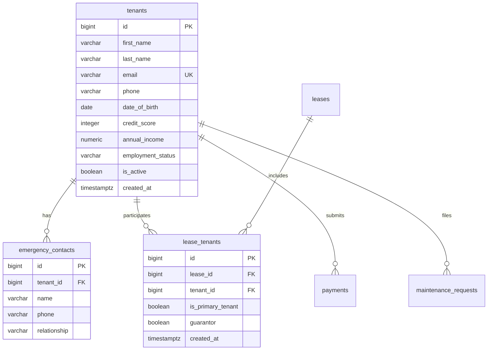

# Module 03: Tenant Lifecycle Management & Resident Operations

## 1. Module Overview & Business Context
Tenant management in enterprise real estate software spans the complete resident journey:
1. **Applicant Intake**: Storing demographic, employment, and income data.
2. **Screening & Verification**: Credit score tracking, background checks, guarantor/co-signer identification.
3. **Active Residency**: Linking residents to contracts, recording emergency contacts, and dispatching billing notices.
4. **Move-Out & History Retention**: Maintaining historical ledger balances while respecting data privacy regulations (GDPR, CCPA, and Fair Housing regulations).

---

## 2. Technology Stack & Frameworks

| Layer | Framework / Technology | Usage in Tenant Lifecycle |
| :--- | :--- | :--- |
| **Backend Core** | Spring Boot 3.3.4 (Java 21) | `TenantController`, `TenantService`, DTO validations (`@Email`, `@Pattern`). |
| **Persistence** | Spring Data JPA / Hibernate | Entity mappings for `Tenant`, `EmergencyContact`, `LeaseTenant`. |
| **Database Engine** | PostgreSQL 16 | Relational tables, indexing on email/phone, JSONB notes, and check constraints. |
| **Frontend Core** | React 19 + TypeScript | `TenantsPage.tsx`, resident modal onboarding dialogs, directory search. |
| **State Management** | TanStack React Query | Query caching, optimistic updates, and search debounce. |
| **UI Components** | Tailwind CSS + Custom UI Kit | `StatCard`, `StatusBadge`, `Pagination`, `SearchBar`. |

---

## 3. API Specifications & Data Contracts

### 3.1. Tenant Endpoints (`/api/tenants`)
- `GET /api/tenants`: Lists tenants with pagination (`page`, `size`), sorting (`sort=lastName,asc`), and query searching.
- `GET /api/tenants/{id}`: Returns complete tenant profile, emergency contacts, active lease, and historical invoices.
- `POST /api/tenants`: Onboards a new tenant.
  - **Sample Request**:
    ```json
    {
      "firstName": "Sophia",
      "lastName": "Chen",
      "email": "sophia.chen@example.com",
      "phone": "+1-425-555-0182",
      "dateOfBirth": "1992-05-14",
      "creditScore": 760,
      "annualIncome": 115000.00,
      "employmentStatus": "EMPLOYED",
      "emergencyContactName": "David Chen",
      "emergencyContactPhone": "+1-425-555-0199",
      "emergencyContactRelation": "Brother"
    }
    ```
- `PUT /api/tenants/{id}`: Updates contact, employment, or emergency contact information.
- `DELETE /api/tenants/{id}`: Soft-deletes tenant (`is_active = false`).

---

## 4. Database Schema & Relationships



### Relational Integrity & Business Rules
- **Multi-Tenant Support (Roommates & Co-Signers)**: Modeled via `lease_tenants`. An apartment can have multiple co-tenants on the same lease contract, with exactly one designated as `is_primary_tenant = true` for primary communications and legal notice service.
- **Guarantors**: Co-signers who assume financial liability without physical residency have `guarantor = true`.

---

## 5. Security, PII & Privacy Regulations

1. **Tax ID / SSN Masking**:
   Social Security Numbers (SSN) and Tax IDs are encrypted before insertion using AES-256 or truncated in responses to the last four digits (`***-**-6789`).
2. **GDPR / "Right to Be Forgotten" in Financial Systems**:
   If a tenant requests account erasure under GDPR, legal accounting records (invoices, tax statements, payment vouchers) cannot be deleted under IRS and GAAP statutory retention laws (7-year rule). 
   - **PropLedger Solution**: We pseudonymize PII (`first_name = 'REDACTED'`, `email = 'redacted_104@propledger.internal'`) while preserving the financial ledger balances and payment audit trails.

---

## 6. Interview Q&A (Technical & System Design)

### Q1: How do you model a lease where two roommates split rent and one parent acts as a guarantor?
> **Answer**: We use the `lease_tenants` junction table:
> 1. Roommate 1: `tenant_id = 101`, `lease_id = 50`, `is_primary_tenant = true`, `guarantor = false`.
> 2. Roommate 2: `tenant_id = 102`, `lease_id = 50`, `is_primary_tenant = false`, `guarantor = false`.
> 3. Parent: `tenant_id = 103`, `lease_id = 50`, `is_primary_tenant = false`, `guarantor = true`.
> Invoices are issued against the contract `lease_id = 50`. Under joint and several liability clauses standard in real estate contracts, all three entities share contractual liability, but statements default to the primary tenant.

### Q2: How do you optimize search across 100,000 tenants when users search by partial name, email, or phone?
> **Answer**: Standard B-Tree indexes cannot accelerate leading wildcard queries like `WHERE email LIKE '%chen%'`. In PropLedger:
> 1. Exact email lookups use a unique B-Tree index: `CREATE UNIQUE INDEX idx_tenants_email ON tenants(email);`.
> 2. Fuzzy / partial substring searches use PostgreSQL's `pg_trgm` extension with GIN indexes:
>    ```sql
>    CREATE EXTENSION IF NOT EXISTS pg_trgm;
>    CREATE INDEX idx_tenants_search_trgm ON tenants 
>    USING gin ((first_name || ' ' || last_name || ' ' || email) gin_trgm_ops);
>    ```
> This executes $O(\log N)$ token lookups in sub-millisecond time.
