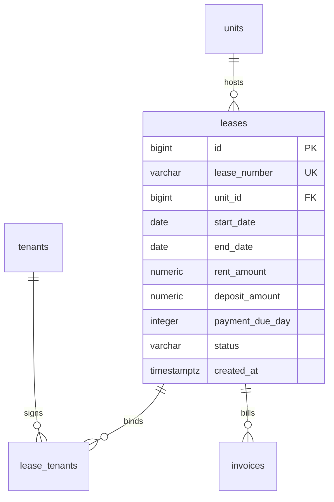

# Module 04: Lease Management & Temporal Concurrency Engine

## 1. Module Overview & Business Context
The **Lease Engine** represents the core revenue-generating legal instrument in commercial and residential property management (analogous to Yardi Voyager's Residential Lease Processing).

A lease contract binds one or more tenants to a specific physical unit across a precise calendar date range (`start_date` to `end_date`), establishing:
- Contractual monthly rent and recurring charges.
- Security deposit holdings.
- Monthly payment due day (1st through 28th).
- Contract state transitions: `DRAFT` $\to$ `ACTIVE` $\to$ `RENEWED` / `EXPIRED` / `TERMINATED`.

The primary technical challenge is **temporal non-overlap concurrency**: guaranteeing that two independent leasing agents cannot lease the same apartment to different clients for overlapping calendar windows.

---

## 2. Technology Stack & Frameworks

| Layer | Framework / Technology | Usage in Lease Engine |
| :--- | :--- | :--- |
| **Backend Core** | Spring Boot 3.3.4 (Java 21) | `LeaseController`, `LeaseService`, DTO validation (`@FutureOrPresent`, `@DecimalMin`). |
| **Persistence** | Spring Data JPA / Hibernate | Entity mappings for `Lease`, `LeaseTenant`, Pessimistic Lock queries. |
| **Database Engine** | PostgreSQL 16 (`btree_gist`) | Range types (`daterange`), GiST exclusion constraints, and status-sync triggers. |
| **Frontend Core** | React 19 + TypeScript | `LeasesPage.tsx`, lease creation wizard, status filters, renewal dialogs. |
| **Data Fetching** | TanStack React Query | Query caching, optimistic state updates, and mutation invalidation. |
| **UI Components** | Tailwind CSS + Lucide Icons | Modal dialogs, date range pickers, status badges. |

---

## 3. API Specifications & Data Contracts

### 3.1. Lease Endpoints (`/api/leases`)
- `GET /api/leases`: Lists leases with filters: `status`, `unitId`, `tenantId`, `page`, `size`.
- `GET /api/leases/{id}`: Returns lease details, primary tenant, co-tenants, deposit record, and billed invoices.
- `POST /api/leases`: Executes a new lease.
  - **Sample Request**:
    ```json
    {
      "leaseNumber": "LSE-2026-0042",
      "unitId": 12,
      "primaryTenantId": 4,
      "additionalTenantIds": [5],
      "startDate": "2026-10-01",
      "endDate": "2027-09-30",
      "rentAmount": 2400.00,
      "depositAmount": 2400.00,
      "paymentDueDay": 1,
      "status": "ACTIVE"
    }
    ```
- `PUT /api/leases/{id}/terminate`: Early-terminates a lease, recalculating move-out balance and freeing the unit.
- `PUT /api/leases/{id}/renew`: Creates a renewal extension contract.

---

## 4. Database Schema & Temporal Constraint Architecture



### 4.1. The PostgreSQL GiST Exclusion Constraint
To guarantee zero double-booking at the database engine level, PropLedger implements:

```sql
CREATE EXTENSION IF NOT EXISTS btree_gist;

ALTER TABLE leases
ADD CONSTRAINT exclude_overlapping_active_leases
EXCLUDE USING gist (
    unit_id WITH =,
    daterange(start_date, end_date, '[]') WITH &&
)
WHERE (status IN ('ACTIVE', 'DRAFT', 'RENEWED'));
```

#### Why Application-Level Checks Fail:
```text
Agent 1: SELECT COUNT(*) FROM leases WHERE unit_id = 12 AND dates overlap... (Returns 0)
Agent 2: SELECT COUNT(*) FROM leases WHERE unit_id = 12 AND dates overlap... (Returns 0)
Agent 1: INSERT INTO leases ... (Commits)
Agent 2: INSERT INTO leases ... (Commits -> CORRUPTION: DOUBLE BOOKING!)
```
With PostgreSQL's **GiST exclusion constraint**, Agent 2's `INSERT` is rejected atomically at transaction commit with:
`ERROR: conflicting key value violates exclusion constraint "exclude_overlapping_active_leases" (SQLState: 23P01)`.

---

## 5. Automated Unit State Synchronization Trigger

When a lease transitions to `ACTIVE`, the underlying physical unit must immediately reflect `OCCUPIED`. When the lease expires or is terminated, it must revert to `AVAILABLE`:

```sql
CREATE OR REPLACE FUNCTION fn_sync_unit_status_on_lease()
RETURNS TRIGGER AS $$
BEGIN
    IF (TG_OP = 'INSERT' OR TG_OP = 'UPDATE') THEN
        IF NEW.status = 'ACTIVE' THEN
            UPDATE units SET status = 'OCCUPIED' WHERE id = NEW.unit_id;
        ELSIF NEW.status IN ('TERMINATED', 'EXPIRED') THEN
            -- Only mark available if no other active lease exists
            IF NOT EXISTS (
                SELECT 1 FROM leases 
                WHERE unit_id = NEW.unit_id 
                  AND status = 'ACTIVE' 
                  AND id <> NEW.id
            ) THEN
                UPDATE units SET status = 'AVAILABLE' WHERE id = NEW.unit_id;
            END IF;
        END IF;
    END IF;
    RETURN NEW;
END;
$$ LANGUAGE plpgsql;

CREATE TRIGGER trg_sync_unit_status_on_lease
AFTER INSERT OR UPDATE OF status ON leases
FOR EACH ROW
EXECUTE FUNCTION fn_sync_unit_status_on_lease();
```

---

## 6. Interview Q&A (Technical & System Design)

### Q1: Why use PostgreSQL `daterange` with GiST instead of standard composite indexes?
> **Answer**: Standard B-tree indexes only support scalar equality and 1-dimensional inequality. They cannot index two-dimensional interval intersections ($[S_1, E_1] \cap [S_2, E_2] \neq \emptyset$). PostgreSQL's `daterange` with `btree_gist` creates an R-Tree-like bounding box hierarchy in memory, allowing the engine to detect overlapping date windows in $O(\log N)$ time and enforce it as an ACID constraint.

### Q2: How does PropLedger handle lease renewal rent escalations?
> **Answer**: In real estate operations, modifying an active lease contract mid-term compromises legal audits. Instead, PropLedger creates a **new lease record** linked via `renewed_from_lease_id` with `status = 'DRAFT'`. Its `start_date` begins exactly on `previous_lease.end_date + 1 day`. When approved, the new lease transitions to `ACTIVE`, and the previous lease transitions to `RENEWED`. Both records remain permanently intact for historical financial reporting.
