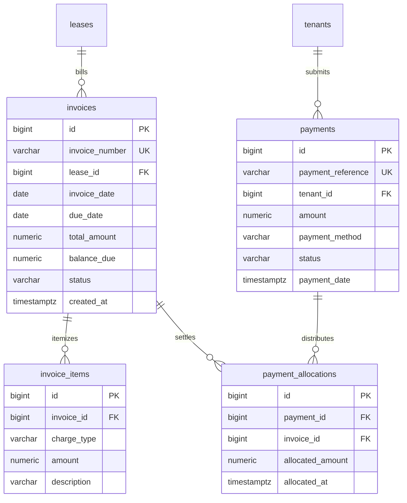

# Module 05: Invoicing, Billing & Payment Settlement Subledger

## 1. Module Overview & Business Context
The **Financial Subledger** is the most critical component of PropLedger, directly mirroring enterprise accounting standards used in **Yardi Voyager**, **RealPage**, and **Oracle Financials**.

It governs the entire Accounts Receivable (AR) flow:
1. **Recurring Billing**: Generating monthly rent, parking, utility, and pet fee invoices on the 1st of each month.
2. **Line Item Breakdown**: Tracking individual charges atomically (`BASE_RENT`, `LATE_FEE`, `UTILITY_WATER`).
3. **Payment Processing**: Ingesting payments via ACH, Credit Card, Check, or Wire Transfer.
4. **Multi-Invoice Settlement**: Allocating a single payment across multiple overdue and current invoices with double-entry precision.
5. **Ledger Invariants**: Enforcing that `balance_due` can never become negative, payments cannot be double-counted, and settled invoices cannot be deleted.

---

## 2. Technology Stack & Frameworks

| Layer | Framework / Technology | Usage in Financial Ledger |
| :--- | :--- | :--- |
| **Backend Core** | Spring Boot 3.3.4 (Java 21) | `InvoiceController`, `PaymentController`, `InvoiceService`, `PaymentService`. |
| **Transactions** | Spring `@Transactional` | Atomicity boundaries, explicit rollback policies, and pessimistic row locking (`@Lock`). |
| **Database Engine** | PostgreSQL 16 | Financial precision (`NUMERIC(14,2)`), check constraints, row-level allocation triggers. |
| **Frontend Core** | React 19 + TypeScript | `InvoicesPage.tsx`, `PaymentsPage.tsx`, payment settlement modal with dynamic allocation splitters. |
| **State Management** | TanStack React Query | Cache invalidation: invalidating `['invoices']`, `['payments']`, and `['dashboard-stats']` in unison. |
| **UI Components** | Tailwind CSS + Lucide Icons | Financial currency formatting, overdue aging badges, modal workflows. |

---

## 3. API Specifications & Data Contracts

### 3.1. Invoices API (`/api/invoices`)
- `GET /api/invoices`: Filterable by `leaseId`, `status`, `overdueOnly`, `startDate`, `endDate`.
- `GET /api/invoices/{id}`: Returns invoice header, itemized line charges, and historical payment allocations.
- `POST /api/invoices`: Creates a manual charge invoice.
- `POST /api/invoices/generate-monthly`: Scheduled or manual trigger to batch-generate recurring rent invoices across all active leases.

### 3.2. Payments API (`/api/payments`)
- `GET /api/payments`: Lists payments with filters: `tenantId`, `paymentMethod`, `status`.
- `GET /api/payments/{id}`: Retrieves payment receipt and settled allocations.
- `POST /api/payments`: Submits and allocates a payment.
  - **Sample Request (Multi-Invoice Allocation)**:
    ```json
    {
      "tenantId": 4,
      "amount": 2500.00,
      "paymentMethod": "ACH",
      "referenceNumber": "ACH-CONF-992144",
      "allocations": [
        {
          "invoiceId": 101,
          "amount": 1800.00
        },
        {
          "invoiceId": 102,
          "amount": 700.00
        }
      ]
    }
    ```

---

## 4. Database Schema & Ledger Architecture



### Relational Constraints & Invariants:
1. **Non-Negative Balance**:
   `CONSTRAINT chk_invoice_balance CHECK (balance_due >= 0 AND balance_due <= total_amount)`
2. **Positive Allocations**:
   `CONSTRAINT chk_alloc_positive CHECK (allocated_amount > 0)`
3. **Allocation Sum Matching**:
   A payment cannot allocate more funds than the payment's total `amount`.

---

## 5. ACID Allocation Trigger Implementation

Rather than relying on client application code to recalculate balances (which risks race conditions), PostgreSQL manages invoice balances via a row-level trigger:

```sql
CREATE OR REPLACE FUNCTION fn_update_invoice_balance()
RETURNS TRIGGER AS $$
DECLARE
    v_total_allocated NUMERIC(14,2);
    v_total_amount NUMERIC(14,2);
    v_invoice_id BIGINT;
BEGIN
    v_invoice_id := COALESCE(NEW.invoice_id, OLD.invoice_id);

    -- Calculate sum of all settled allocations
    SELECT COALESCE(SUM(allocated_amount), 0.00)
    INTO v_total_allocated
    FROM payment_allocations
    WHERE invoice_id = v_invoice_id;

    -- Fetch total invoice amount
    SELECT total_amount INTO v_total_amount
    FROM invoices
    WHERE id = v_invoice_id;

    -- Atomically update balance and status
    UPDATE invoices
    SET balance_due = v_total_amount - v_total_allocated,
        status = CASE 
            WHEN (v_total_amount - v_total_allocated) <= 0.00 THEN 'PAID'
            WHEN v_total_allocated > 0.00 THEN 'PARTIALLY_PAID'
            ELSE 'PENDING'
        END
    WHERE id = v_invoice_id;

    RETURN NEW;
END;
$$ LANGUAGE plpgsql;

CREATE TRIGGER trg_update_invoice_balance
AFTER INSERT OR UPDATE OR DELETE ON payment_allocations
FOR EACH ROW
EXECUTE FUNCTION fn_update_invoice_balance();
```

---

## 6. Concurrency Control: Pessimistic Row Locking

To prevent race conditions where concurrent payments attempt to allocate against the same invoice simultaneously:

```java
@Transactional(isolation = Isolation.READ_COMMITTED, rollbackFor = Exception.class)
public PaymentResponseDto processPayment(PaymentRequestDto dto) {
    // 1. Sort invoice IDs to prevent deadlocks
    List<Long> targetInvoiceIds = dto.getAllocations().stream()
        .map(AllocationItemDto::getInvoiceId)
        .sorted()
        .toList();

    // 2. Acquire Pessimistic Write Lock (SELECT FOR UPDATE)
    Map<Long, Invoice> lockedInvoices = new HashMap<>();
    for (Long invId : targetInvoiceIds) {
        Invoice inv = invoiceRepository.findByIdForUpdate(invId)
            .orElseThrow(() -> new EntityNotFoundException("Invoice not found: " + invId));
        lockedInvoices.put(invId, inv);
    }

    // 3. Validate requested allocations against remaining balances
    for (AllocationItemDto alloc : dto.getAllocations()) {
        Invoice inv = lockedInvoices.get(alloc.getInvoiceId());
        if (alloc.getAmount().compareTo(inv.getBalanceDue()) > 0) {
            throw new BusinessRuleException("Allocation exceeds remaining balance for Invoice " + inv.getInvoiceNumber());
        }
    }

    // 4. Save Payment and Allocations
    ...
}
```

---

## 7. Interview Q&A (Technical & System Design)

### Q1: How do you design a batch billing job to generate 200,000 monthly rent invoices without locking the database?
> **Answer**:
> 1. **Chunked Processing with Spring Batch / Cursor Pagination**: We partition the active lease dataset by `property_id` or hash modulus into chunks of 500 records.
> 2. **Short-Lived Transactions**: Each chunk commits independently inside its own transaction boundary. If chunk 42 fails, chunks 1 through 41 remain committed.
> 3. **Idempotency Key**: Each invoice is generated with a deterministic business key: `INV-{lease_id}-{YYYY-MM}`. A unique constraint on this key guarantees that running the job twice will never double-bill a resident.

### Q2: What is the difference between Cash Basis and Accrual Basis accounting in property management?
> **Answer**:
> - **Accrual Basis**: Revenue is recognized when earned, regardless of when cash arrives. In PropLedger, an `invoice` creates an immediate Accounts Receivable entry on the 1st of the month.
> - **Cash Basis**: Revenue is recognized only when cash is physically received and settled in the bank. PropLedger models both: the `invoices` table tracks Accrual AR, while the `payments` and `payment_allocations` tables track Cash Basis receipts, enabling instant reconciliation between both methods.
