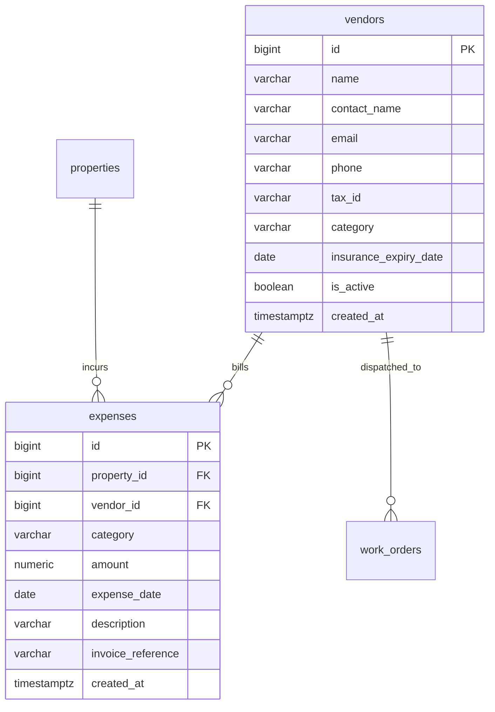

# Module 06: Operating Expenses & Vendor Management (Accounts Payable)

## 1. Module Overview & Business Context
In commercial and multifamily real estate investment, asset valuation is determined directly by **Net Operating Income (NOI)**:
$$\text{NOI} = \text{Effective Gross Revenue} - \text{Operating Expenses (OpEx)}$$

The **Expense & Vendor Subsystem** governs Accounts Payable (AP):
1. **Operating Expenses (OpEx)**: Routine expenditures required to operate the property (Landscaping, HVAC maintenance, City Water, Property Taxes, Hazard Insurance).
2. **Capital Expenditures (CapEx)**: Long-term asset improvements (Roof replacement, parking lot repaving) capitalized on the balance sheet.
3. **Vendor Compliance**: Tracking third-party contractors, EIN / Tax IDs for IRS Form 1099-MISC/NEC reporting, and Certificate of Insurance (COI) expirations.

---

## 2. Technology Stack & Frameworks

| Layer | Framework / Technology | Role in Payables Operations |
| :--- | :--- | :--- |
| **Backend Core** | Spring Boot 3.3.4 (Java 21) | `ExpenseController`, `VendorController`, `ExpenseService`, `VendorService`. |
| **Persistence** | Spring Data JPA / Hibernate | Entity mappings for `Expense`, `Vendor`, and expense category aggregates. |
| **Database Engine** | PostgreSQL 16 | Category check constraints, relational joins, indexing on expense dates. |
| **Frontend Core** | React 19 + TypeScript | `ExpensesPage.tsx`, `VendorsPage.tsx`, expense creation modal, vendor filter dropdowns. |
| **Data Fetching** | TanStack React Query | Query caching, invalidating expense and report caches on voucher logging. |
| **UI Components** | Tailwind CSS + Lucide Icons | Category pill badges, currency formatters, vendor compliance tags. |

---

## 3. API Specifications & Data Contracts

### 3.1. Expenses API (`/api/expenses`)
- `GET /api/expenses`: Filterable by `propertyId`, `vendorId`, `category`, `startDate`, `endDate`.
- `POST /api/expenses`: Records an operating expense voucher.
  - **Sample Request**:
    ```json
    {
      "propertyId": 1,
      "vendorId": 3,
      "category": "UTILITIES",
      "amount": 1420.50,
      "expenseDate": "2026-09-05",
      "description": "City water and sewage utility bill for Main Tower",
      "invoiceReference": "INV-SEATTLE-WATER-8812"
    }
    ```
- `GET /api/expenses/summary`: Aggregates total spend grouped by category and property.

### 3.2. Vendors API (`/api/vendors`)
- `GET /api/vendors`: Lists registered service contractors and suppliers.
- `POST /api/vendors`: Registers a new vendor.
  - **Sample Request**:
    ```json
    {
      "name": "Apex HVAC & Refrigeration",
      "contactName": "Marcus Vance",
      "email": "service@apexhvac.com",
      "phone": "+1-206-555-0144",
      "taxId": "XX-XXX4912",
      "category": "HVAC",
      "insuranceExpiryDate": "2027-06-30"
    }
    ```

---

## 4. Database Schema & Relational Design



### Relational Constraints
- **Allowed Categories**:
  `CONSTRAINT chk_expense_category CHECK (category IN ('REPAIRS', 'UTILITIES', 'LANDSCAPING', 'INSURANCE', 'PROPERTY_TAX', 'LEGAL', 'MANAGEMENT_FEE', 'CAPITAL_IMPROVEMENT'))`
- **Positive Spend**:
  `CONSTRAINT chk_expense_amount CHECK (amount > 0.00)`

---

## 5. Net Operating Income (NOI) Financial Query

The primary financial metric calculated from this module:

```sql
SELECT 
    p.id AS property_id,
    p.name AS property_name,
    COALESCE(SUM(pa.allocated_amount), 0.00) AS gross_revenue_collected,
    COALESCE(exp.total_opex, 0.00) AS total_operating_expenses,
    (COALESCE(SUM(pa.allocated_amount), 0.00) - COALESCE(exp.total_opex, 0.00)) AS net_operating_income
FROM properties p
LEFT JOIN units u ON u.property_id = p.id
LEFT JOIN leases l ON l.unit_id = u.id
LEFT JOIN invoices i ON i.lease_id = l.id
LEFT JOIN payment_allocations pa ON pa.invoice_id = i.id 
    AND pa.allocated_at >= '2026-01-01' AND pa.allocated_at < '2027-01-01'
LEFT JOIN (
    SELECT property_id, SUM(amount) AS total_opex
    FROM expenses
    WHERE category <> 'CAPITAL_IMPROVEMENT'
      AND expense_date >= '2026-01-01' AND expense_date < '2027-01-01'
    GROUP BY property_id
) exp ON exp.property_id = p.id
GROUP BY p.id, p.name, exp.total_opex;
```

---

## 6. Interview Q&A (Technical & System Design)

### Q1: Why do we exclude Capital Expenditures (`CAPITAL_IMPROVEMENT`) when calculating NOI?
> **Answer**: Under GAAP and real estate accounting rules, Net Operating Income (NOI) evaluates the direct operational efficiency of the property asset. Capital Expenditures (CapEx) represent long-term balance sheet asset improvements (e.g. replacing a roof or elevator) that provide multi-year utility. Including CapEx in OpEx would artificially distort the monthly operational yield of the property.

### Q2: How does PropLedger prevent dispatching an uncertified or uninsured vendor to an emergency work order?
> **Answer**: The `vendors` table maintains an `insurance_expiry_date` column with an index. In `MaintenanceService.dispatchWorkOrder(workOrderId, vendorId)`, the system verifies:
> ```java
> if (vendor.getInsuranceExpiryDate().isBefore(LocalDate.now())) {
>     throw new ComplianceException("Cannot assign vendor: Certificate of Insurance has expired.");
> }
> ```
> This protects the property owner against premises liability claims.
