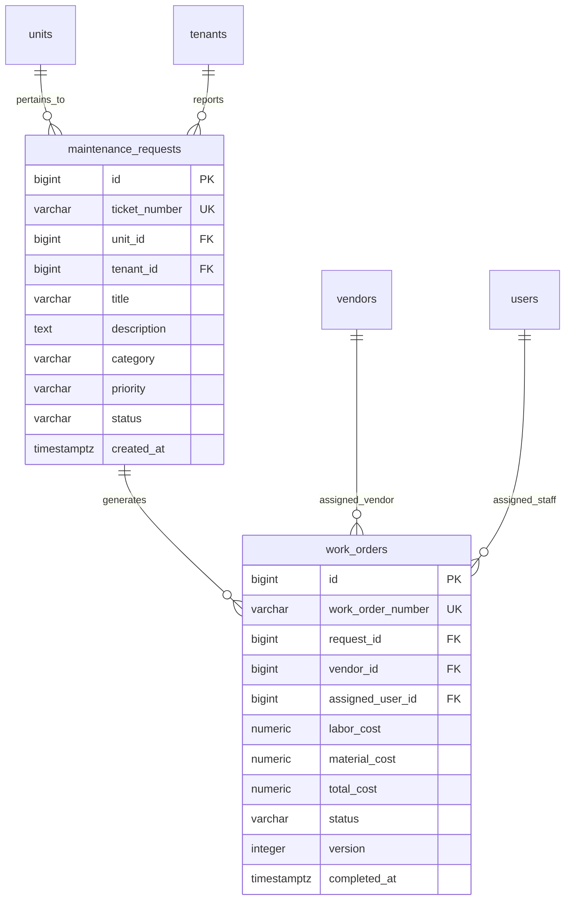

# Module 07: Facilities Maintenance & Work Order Dispatching

## 1. Module Overview & Business Context
Facilities management is a core operational workflow in commercial and multifamily property management (similar to Yardi Maintenance and AppFolio Work Orders).

This subsystem manages the complete ticket lifecycle:
1. **Resident Service Request Intake**: Resident reports an issue (e.g. leaking sink, HVAC outage) via web portal or mobile app with photo attachments.
2. **Triage & Priority Classification**: `EMERGENCY` (flooding, gas, heat outage in winter), `HIGH`, `MEDIUM`, `LOW`.
3. **Dispatch & Work Order Creation**: Converting tickets into formal work orders dispatched to internal technicians or contracted third-party vendors.
4. **Execution & Cost Accounting**: Logging technician labor hours, material costs, and invoice billing.
5. **Resolution & Resident Confirmation**: Status updates with notifications.

---

## 2. Technology Stack & Frameworks

| Layer | Framework / Technology | Usage in Maintenance Operations |
| :--- | :--- | :--- |
| **Backend Core** | Spring Boot 3.3.4 (Java 21) | `MaintenanceController`, `MaintenanceService`, DTO validation. |
| **Persistence** | Spring Data JPA / Hibernate | Entity mappings for `MaintenanceRequest`, `WorkOrder`, Optimistic Locking (`@Version`). |
| **Database Engine** | PostgreSQL 16 | Partial indexes on active tickets, foreign keys, and status check constraints. |
| **Frontend Core** | React 19 + TypeScript | `MaintenancePage.tsx`, ticket submission modal, work order dispatch dialog. |
| **State Management** | TanStack React Query | Real-time state polling and optimistic status mutation. |
| **UI Components** | Tailwind CSS + Lucide Icons | Urgency color indicators (red for EMERGENCY), status badges, timeline logs. |

---

## 3. API Specifications & Data Contracts

### 3.1. Maintenance Endpoints (`/api/maintenance`)
- `GET /api/maintenance`: Lists tickets filterable by `unitId`, `priority`, `status`, `page`, `size`.
- `GET /api/maintenance/{id}`: Returns ticket details, unit location, tenant contact, and linked work orders.
- `POST /api/maintenance`: Submits a new maintenance ticket.
  - **Sample Request**:
    ```json
    {
      "unitId": 14,
      "tenantId": 3,
      "title": "Severe plumbing leak under master bathroom sink",
      "description": "Water is pooling rapidly and dripping through floorboards.",
      "category": "PLUMBING",
      "priority": "EMERGENCY"
    }
    ```
- `PUT /api/maintenance/{id}/status`: Updates ticket status (`IN_PROGRESS`, `COMPLETED`, `CANCELLED`).
- `POST /api/maintenance/{id}/work-order`: Dispatches an official work order to an internal technician or vendor.

---

## 4. Database Schema & Architecture



### Relational Constraints
- **Priority Enum**: `CHECK (priority IN ('LOW', 'MEDIUM', 'HIGH', 'EMERGENCY'))`
- **Category Enum**: `CHECK (category IN ('PLUMBING', 'ELECTRICAL', 'HVAC', 'APPLIANCE', 'STRUCTURAL', 'GENERAL'))`
- **Status State Machine**:
  `SUBMITTED` $\to$ `ASSIGNED` $\to$ `IN_PROGRESS` $\to$ `COMPLETED` / `CANCELLED`.

---

## 5. Concurrency & Lost Update Prevention

### The Mobile Technician Problem:
When a maintenance technician in the basement updates a work order from a mobile tablet at the same moment an office manager is modifying the vendor dispatch details, standard updates cause **lost updates**.

PropLedger implements **Optimistic Locking**:
```java
@Entity
@Table(name = "work_orders")
public class WorkOrder {
    @Id
    @GeneratedValue(strategy = GenerationType.IDENTITY)
    private Long id;

    @Version
    private Integer version;

    private BigDecimal laborCost;
    private BigDecimal materialCost;
    // ...
}
```

When saved:
```sql
UPDATE work_orders 
SET labor_cost = 150.00, version = version + 1 
WHERE id = :id AND version = :expectedVersion;
```
If the version has advanced, Hibernate raises an `OptimisticLockException` and returns `HTTP 409 Conflict`, prompting the client to refresh rather than silently overwriting data.

---

## 6. Interview Q&A (Technical & System Design)

### Q1: How do you handle Service Level Agreements (SLAs) for emergency maintenance tickets?
> **Answer**: We index active tickets with a partial composite index:
> ```sql
> CREATE INDEX idx_emergency_sla ON maintenance_requests (created_at) 
> WHERE status NOT IN ('COMPLETED', 'CANCELLED') AND priority = 'EMERGENCY';
> ```
> A background Spring `@Scheduled` job or message queue listener scans this index every 5 minutes. Any `EMERGENCY` ticket unassigned after 30 minutes triggers automated escalation alerts (SMS/Email via Twilio or SendGrid) to the on-call property supervisor.

### Q2: How would you scale this system to support millions of ticket photo attachments?
> **Answer**: Uploading image binaries directly into PostgreSQL `BYTEA` columns creates catastrophic database bloat and degrades vacuuming performance. Instead:
> 1. Frontend requests a pre-signed S3 upload URL (`POST /api/maintenance/upload-url`).
> 2. The client uploads the image directly to Amazon S3 / Cloudflare R2 object storage.
> 3. The client attaches only the resulting immutable CDN object URL (`https://cdn.propledger.internal/photos/ticket-104-1.webp`) to the maintenance request ticket payload.
