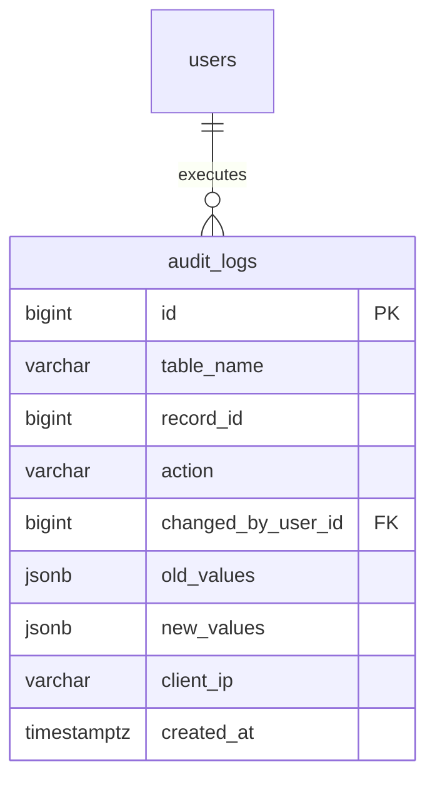

# Module 09: Compliance, Audit Logging & State Reconstruction

## 1. Module Overview & Business Context
Enterprise real estate and property accounting platforms manage billions of dollars in client escrow, security deposits, and contract obligations. Consequently, systems like **Yardi Voyager** and **RealPage** are subject to strict regulatory oversight:
- **SOC 1 / SOC 2 Type II**: Verification of internal financial and security controls.
- **Sarbanes-Oxley (SOX) Section 404**: Immutable audit trails proving that ledger entries were not tampered with post-facto.
- **Fair Housing Act Compliance**: Documenting that tenant screening decisions and fee waivers are executed without discrimination.

The **Audit Subsystem** provides a tamper-resistant, append-only ledger of every mutation executed against critical tables (`leases`, `invoices`, `payments`, `units`).

---

## 2. Technology Stack & Frameworks

| Layer | Framework / Technology | Usage in Audit & Compliance |
| :--- | :--- | :--- |
| **Backend Core** | Spring Boot 3.3.4 (Java 21) | `AuditLogController`, `AuditLogService`, capturing caller metadata from `SecurityContextHolder`. |
| **Persistence** | Spring Data JPA / Hibernate | Entity mapping for `AuditLog`, pagination with keyset and cursor support. |
| **Database Engine** | PostgreSQL 16 | JSONB document storage (`old_values`, `new_values`), immutable permission grants. |
| **Frontend Core** | React 19 + TypeScript | `AuditLogsPage.tsx`, interactive JSON diff modal, search by table/action/user. |
| **Data Fetching** | TanStack React Query | Paginated audit log retrieval with search debouncing. |
| **UI Components** | Tailwind CSS + Lucide Icons | Action color badges (`INSERT` = green, `UPDATE` = blue, `DELETE` = red), code diff blocks. |

---

## 3. API Specifications & Data Contracts

### 3.1. Audit Endpoints (`/api/audit-logs`)
- `GET /api/audit-logs`: Retrieves audit trails.
  - **Query Parameters**:
    - `tableName`: Filter by entity (e.g. `leases`, `invoices`, `payments`).
    - `recordId`: Filter by primary key of modified record.
    - `action`: `INSERT`, `UPDATE`, `DELETE`.
    - `userId`: Identifier of the operator who executed the change.
    - `startDate` / `endDate`: Date range boundaries.
  - **Sample Response**:
    ```json
    {
      "content": [
        {
          "id": 1042,
          "tableName": "leases",
          "recordId": 42,
          "action": "UPDATE",
          "changedByUserId": 2,
          "changedByUsername": "manager@propledger.com",
          "oldValues": {
            "rentAmount": 2200.00,
            "status": "DRAFT"
          },
          "newValues": {
            "rentAmount": 2400.00,
            "status": "ACTIVE"
          },
          "clientIp": "192.168.1.105",
          "createdAt": "2026-09-12T10:14:22Z"
        }
      ],
      "pageNumber": 0,
      "pageSize": 20,
      "totalElements": 1,
      "totalPages": 1,
      "last": true
    }
    ```

---

## 4. Database Schema & Immutability Architecture



### Enforcing Engine-Level Immutability:
Application code connects to PostgreSQL as a service user (`propledger_app`). To guarantee an attacker with compromised application credentials cannot scrub the audit trail:
```sql
-- Database Security Policy
REVOKE UPDATE, DELETE ON audit_logs FROM propledger_app;
GRANT INSERT, SELECT ON audit_logs TO propledger_app;
```
Even if an attacker gains full SQL injection access, PostgreSQL blocks any attempt to `UPDATE` or `DELETE` audit rows:
`ERROR: permission denied for table audit_logs`.

---

## 5. Historical State Reconstruction Query

Because each audit row stores a JSONB snapshot of modified fields, analysts can reconstruct an entity's complete historical state at any point in time:

```sql
-- Reconstruct the state of Lease #42 as of 2026-06-01 00:00:00 UTC
SELECT 
    record_id,
    table_name,
    created_at AS transition_time,
    action,
    new_values->>'status' AS status_after_change,
    new_values->>'rent_amount' AS rent_amount_after_change,
    changed_by_user_id
FROM audit_logs
WHERE table_name = 'leases'
  AND record_id = 42
  AND created_at <= '2026-06-01 00:00:00+00'
ORDER BY created_at ASC;
```

---

## 6. Interview Q&A (Technical & System Design)

### Q1: Should audit logging be implemented via Database Triggers or Application-Level Interceptors?
> **Answer**:
> - **Database Triggers**: Guaranteed execution even if changes are made via direct `psql` console, database migrations, or third-party tools. Drawback: Cannot easily capture application-level context (e.g. current HTTP user session, tenant organization context, or client IP).
> - **Application Interceptors (Spring JPA EntityListeners / Hibernate Interceptors)**: Captures rich user context (`SecurityContextHolder`, Client IP, User Agent). Drawback: Bypassed if a DBA runs a raw SQL script directly on the database.
> - **PropLedger Best Practice**: We combine both: application-level audit logging for user-initiated API transactions, paired with PostgreSQL database triggers on critical tables that record fallback audit events when `changed_by_user_id` is null (indicating direct console access).

### Q2: How do you prevent the `audit_logs` table from growing so large that it exhausts disk space?
> **Answer**: We use **PostgreSQL Declarative Table Partitioning by Range**:
> ```sql
> CREATE TABLE audit_logs (
>     id BIGSERIAL,
>     table_name VARCHAR(100) NOT NULL,
>     record_id BIGINT NOT NULL,
>     action VARCHAR(20) NOT NULL,
>     created_at TIMESTAMPTZ NOT NULL,
>     ...
> ) PARTITION BY RANGE (created_at);
> ```
> We create monthly partitions (e.g. `audit_logs_2026_09`). Partitions older than the statutory retention period (e.g., 7 years) are detached (`ALTER TABLE DETACH PARTITION`), compressed, and archived to AWS S3 Glacier / cold storage, maintaining lightning-fast query performance on recent audit trails.
